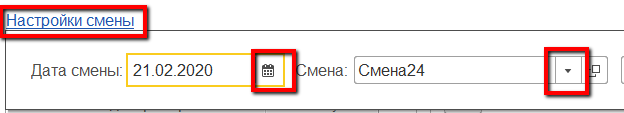
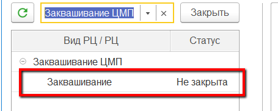
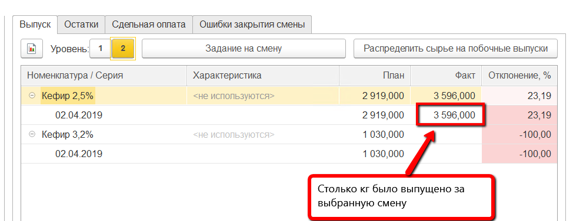
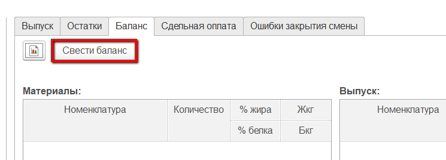
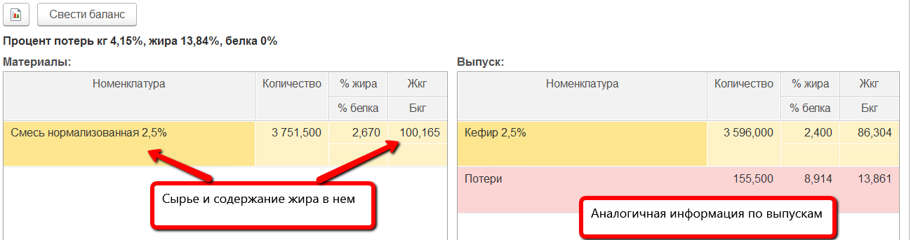
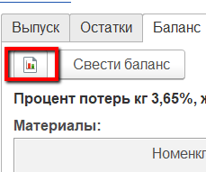
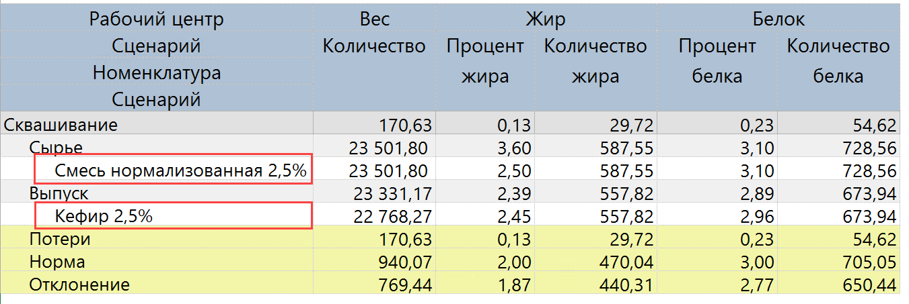
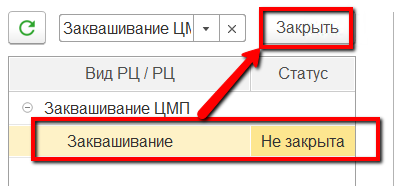

# Контроль и закрытие смены

Контроль всех введенных в систему данных за рабочую смену осуществляется
мастером смены через "Рабочее место мастера смены"

-   Открыть "Рабочее место мастера смены":      

-   Указать дату и смену:  

-   Указать участок, на котором выпускаются полуфабрикаты:  

-   Выбрать этот же участок в таблице ниже:  

-   Заполнится различная информация по вкладкам справа. Например, на
    вкладке "Выпуск" можно видеть все выпуски за указанную смену:  

-   На вкладке "Баланс" можно посмотреть ранее сведенный баланс по жиру
    и белку или свести его, нажав кнопку "Свести баланс":  

-   Тогда таблицы заполнятся материалами и выпусками, содержанием жира и
    белка в каждом из них, а также автоматически расчитаются потери:  

-   Эту же информацию можно посмотреть в отчете, нажав кнопку
    формирования отчета:  
          

-   После того, как все цифры проверены, баланс сведен, смену необходимо
    закрыть, чтобы не было возможности "подправить" данные за неё. Для
    этого выбрать участок варки в таблице слева и нажать "Закрыть":  
