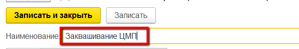
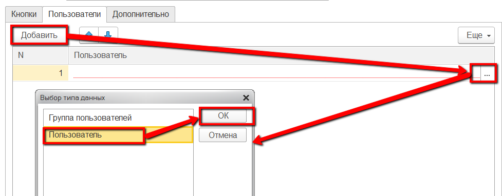
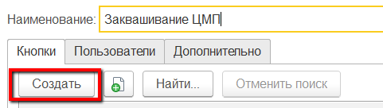
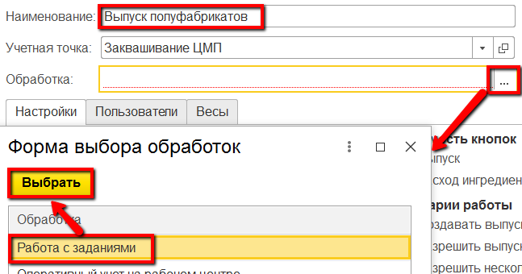
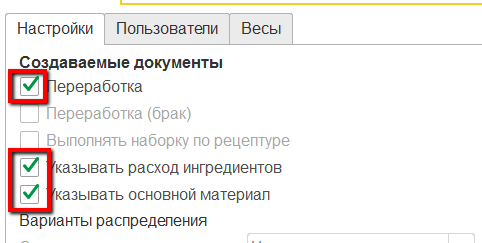
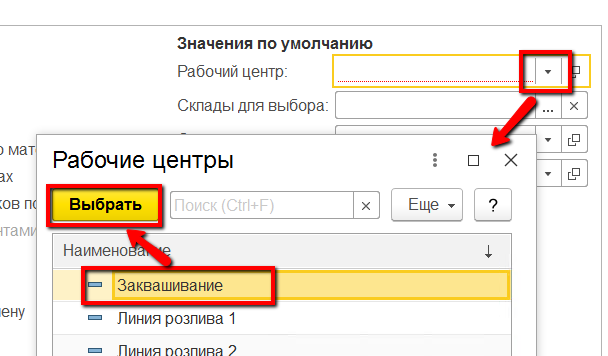
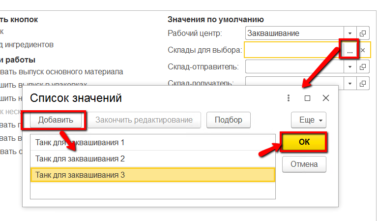

**Учетные точки**
=================

Настройка всех интерфейсов, через которые ведется оперативный учет на
участке заквашивания, происходит через справочники "Учетные точки" и
"Кнопки учетных точек".

**Справочник "Учетные точки".** 

Данный справочник используется для того,
чтобы отделить наборы операций, выполняемых на разных участках
производства. Например, логично отделить операции, связанные с выпусками на этапе заквашивания, от операций, связанных с выпусками на этапе нормализации. При этом, если на предприятии на один только участок заквашивания ставится несколько сенсорных киосков (в ключевых точках - отдельно около счетчика выпущенных полуфабрикатов, отдельно около учета заквасок тп), то разумно на каждый киоск сделать отдельную учетную точку, пусть и с одной операцией.
 

 

-   Открыть справочник "Учетные точки" и перейти к созданию нового
    элемента:

     
-   Указать наименование:
    

     
-   Указать список пользователей, у которых будет доступ к этой учетной
    точке (т.е. только они смогут выполнять операции, относящиеся к этой
    учетной точке):
    

    

     
-  Нажать "Записать и закрыть".
     

**Справочник "Кнопки учетных точек".**  

Данный справочник используется для того, чтобы настраивать различные операции,ивыполняемые на определенном участке производства. Например, для этапа заквашивания логично выделить кнопку для выпуска полуфабрикатов и для учета заквасок, использованных при их изготовлении.

-   Открыть справочник "Учетные точки". Среди списка найти нужную,
    открыть:
    

     
-   В таблице кнопок нажать "Создать":
    

     
-   Указать наименование и выбрать обработку "Работа с заданиями" - если
    выпуск полуфабрикатов идет строго по заданию на смену или
    "Оперативный учет на рабочем центре" - в противном случае:
    

     
-   Указать в создаваемых документах "Переработка" и что через киоск будет также указывается, какие закваски были использованы:
    

     
-   Указать, что на киоске обе кнопки (для учета выпуска и для учета ингредиентов) будут доступны:
    

     
-   Указать участок заквашивания:
    

     
-   Ограничить склады для выпуска:
    

     
-   Нажать "Записать и закрыть".

 

Более подробная информация о параметрах кнопок учетных точек описана в
разделе ["Кнопки учетных точек"](../../../CommonInformation/Handbooks/ButtonOfAccountPoint/readme.md).
