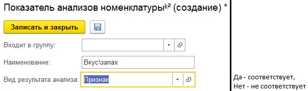
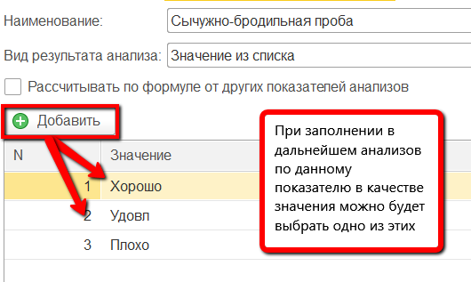
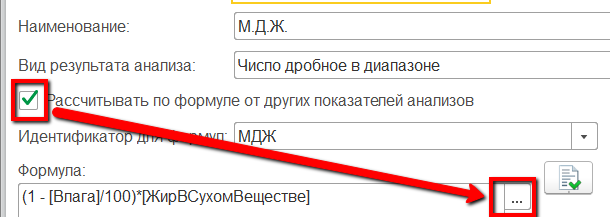
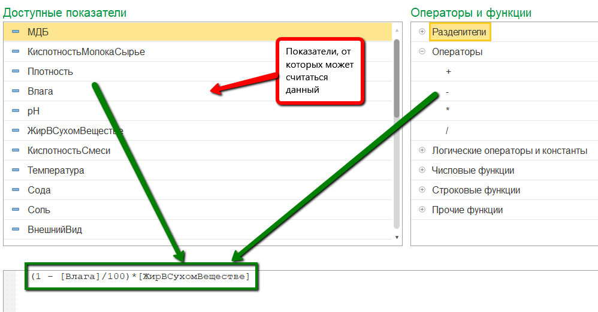
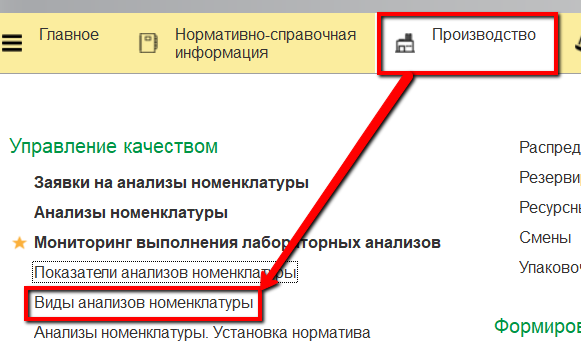
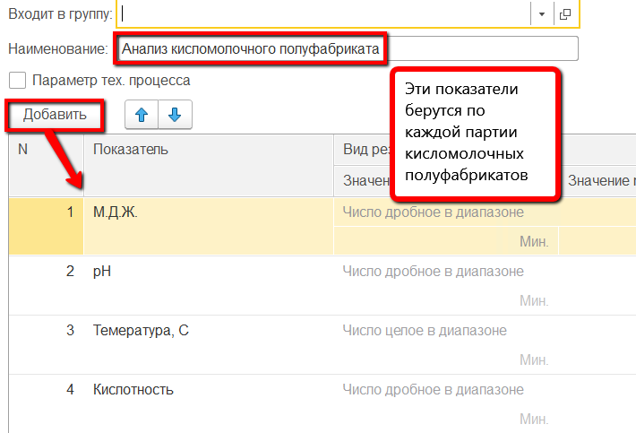

**Лабораторные анализы**
============================================

 

**Справочник "Показатели анализов номенклатуры"**

Все показатели лабораторных анализов, которые учитываются по выпущенным полуфабрикатам, необходимо отразить в справочнике "Показатели анализов
номенклатуры".

1. Открыть справочник и перейти к созданию нового элемента:

2.   Указать наименование показателя и выбрать, к какому виду относится
    его результат:  
    2.1.   Число целое в диапазоне - значение показателя будет целым числом из
    заданного в дальнейшем диапазона;  
    2.2.   Число дробное в диапазоне - аналогично первому, но значение может
    быть дробным;  

2.3.   Признак - имеет два значения: "Да" - соответствует и "Нет" - не
    соответствует указанному признаку;

2.4. Значение из списка - может соответствовать одному из перечисленных в таблице значению:

    
3.   Также возможно, что создаваемый показатель рассчитывается от
    значений других. В таком случае отметить этот пункт галочкой и
    открыть окно для указания формулы:
    

4.   В открывшемся окне указать, по какой формуле считается данный
    показатель и нажать "Записать и закрыть":  
    *Окно создания формулы для показателя*.
    

     

5.   Нажать "Записать и закрыть".

 

**Справочник "Виды анализов номенклатуры"**

Теперь созданные показатели анализов можно объединять в наборы,
соответствующие тем группам показателей, которые по конкретной продукции
берутся вместе (на одном этапе производства). Такие наборы создаются в
справочнике "Виды анализов номенклатуры" (один элемент справочника =
один набор).

 

1.   Открыть справочник и перейти к созданию нового элемента:

2.   Указать наименование набора (для удобства "\<Продукция, по которой
    берется этот набор показателей\> + \<Этап, на котором берется этот
    набор показателей\>") и в таблице перечислить все показатели,
    которые входят в набор:

3.   Нажать "Записать и закрыть".

