**Рецептуры**
=============

Рецептуры по нормативному расходу сырья на этапе заквашивания полуфабрикатов
задаются в справочнике "Ресурсные спецификации". При этом на полуфабрикаты одного вида, но разной жирности следует задавать рецептуры отдельно.

 

-   Открыть справочник и перейти к созданию нового элемента, выбрав
    создание через форму "Работа со спецификацией":  
      
    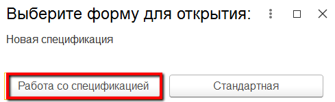
     
-   Нажать кнопку "Выбрать шаблон":  
    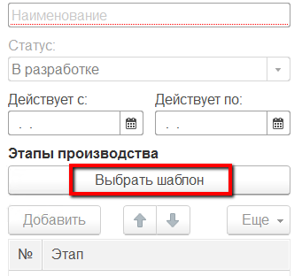

-   Указать, для какого полуфабриката создается эта рецептура:  
    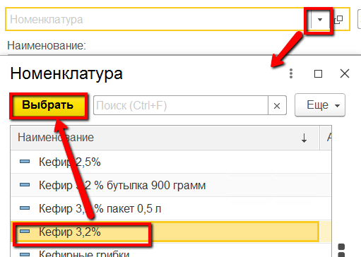
    
 
-   Указать, какой шаблон используется для данной рецептуры:  
    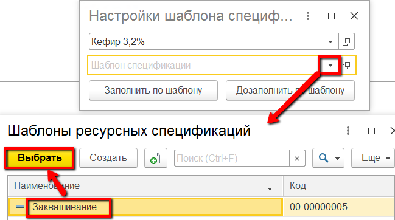
     
-   Нажать "Заполнить по шаблону". Заполнится общая информация на форме:  
    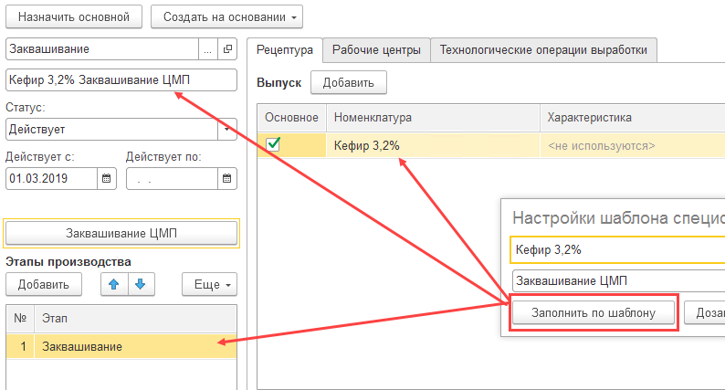
     
-   В таблице выпуска указать, на какой объем будут заданы нормативные значения потребляемых ингредиентов:  
    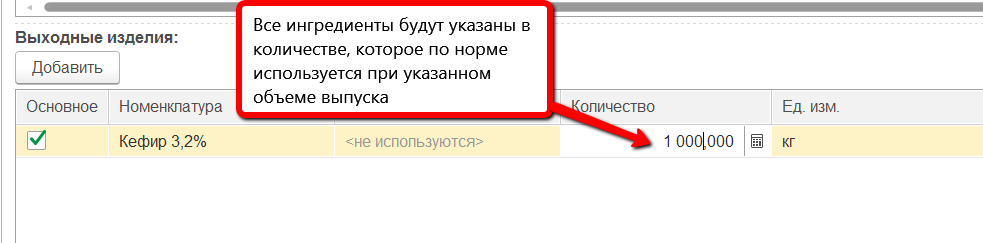
     
-   В таблице материалов нажать "Добавить" и указать основной материал (смесь), используемый при производстве указанного полуфабриката:  
    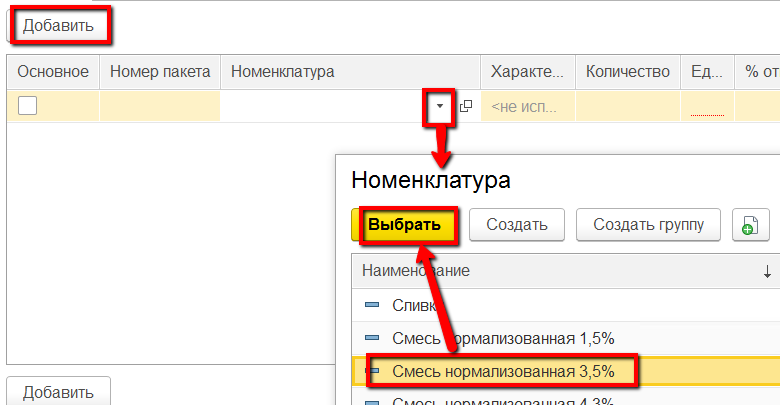
     
-   Указать, что это основной материал, и указать его количество по норме на указанный объем выпуска:  
    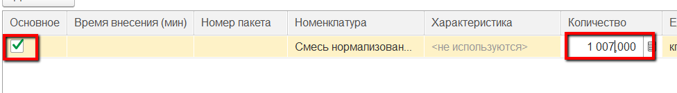
     
-   Указать возможный % отклонения расхода от нормы:  
    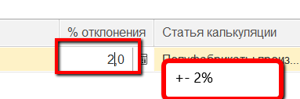
     
-   Через действия "Добавить" - "Указать количество" перечислить в таблице материалов закваски и другие ингредиенты (НЕ устанавливая при этом признак основного):  
    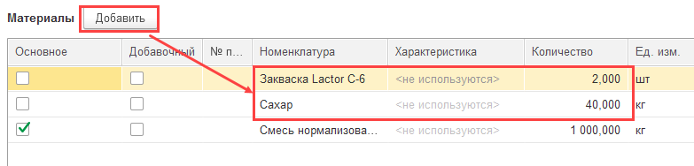

-   Установить статус "Действует":  
    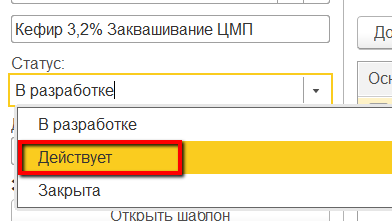
     
-   Записать и закрыть.