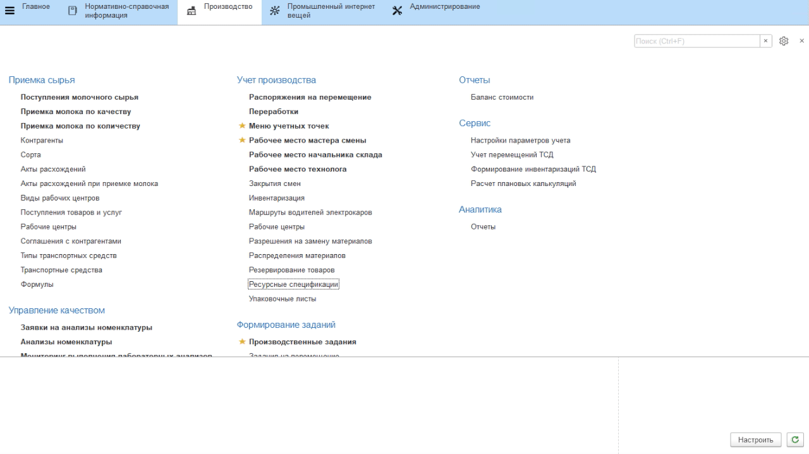
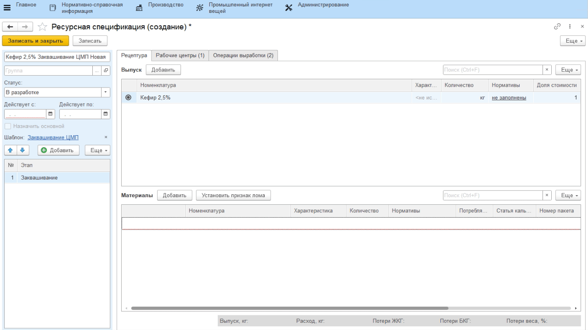
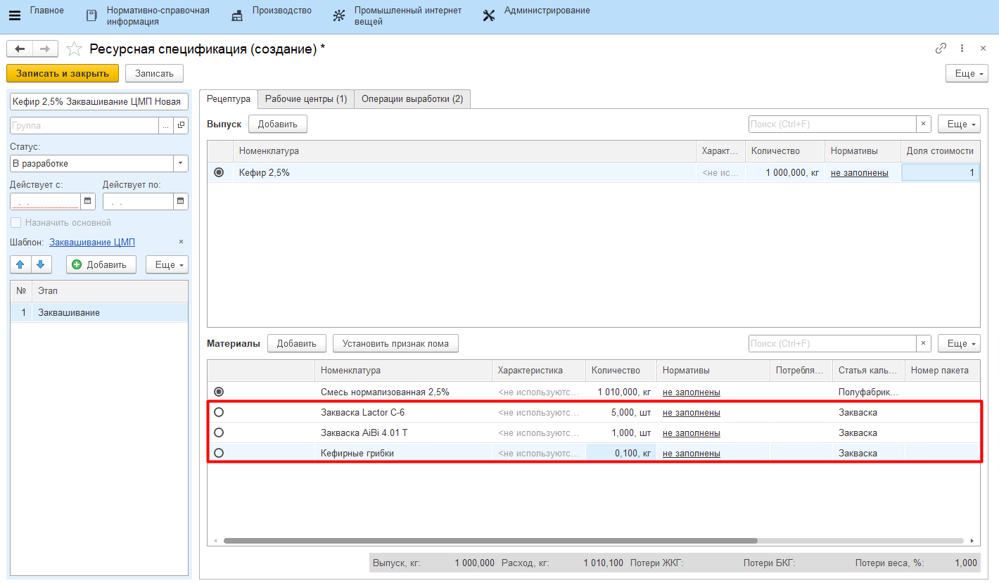

# Ресурсные спецификации

Ресурсные спецификации по нормативному расходу сырья на этапе нормализации молока задаются в справочнике **"Ресурсные спецификации"**. При этом на нормализованное молоко разной жирности задаются разные спецификации.

-   Открыть справочник и перейти к созданию нового элемента, выбрав создание через форму *"Работа со спецификацией"*;  
-   Нажать кнопку **"Выбрать шаблон"**;
-   Указать, для какого полуфабриката создается эта рецептура;
-   Указать, какой шаблон используется для данной рецептуры;
-   Нажать **"Заполнить по шаблону"**. Заполнится общая информация на форме:

- В таблице выпуска указать, на какой объем будут заданы нормативные значения потребляемых ингредиентов;
- В таблице материалов нажать **"Добавить"** и указать основной материал (смесь), используемый при производстве указанного полуфабриката;
- Указать, что это основной материал (закрашенным кружком), и указать его количество по норме на указанный объем выпуска;
- Указать возможный процент (%) отклонения расхода от нормы:

- По кнопке **"Добавить"** перечислить в таблице материалов закваски и другие ингредиенты, необходимые для сквашивания. Указать их нормативные объемы:

- Указать долю стоимости в таблице выпуска (если строка выпуска одна, то долю стоимости можно обозначить единицей);
- Установить статус *"Действует"* и выбрать дату начала действия спецификации;
- Нажать **"Записать и закрыть"**.