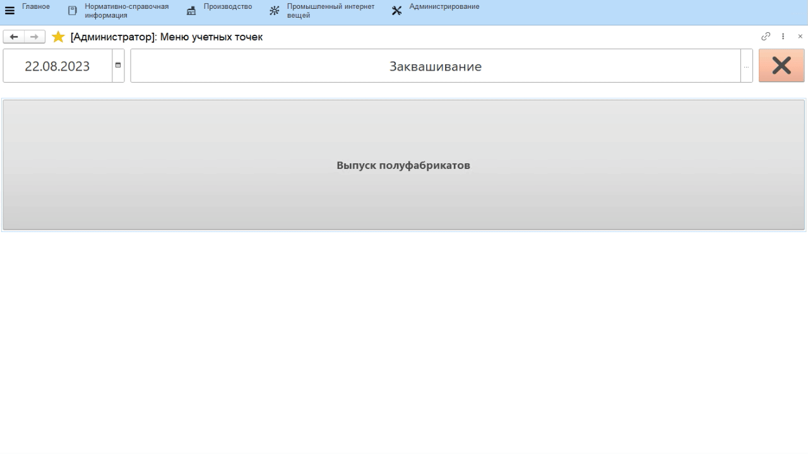

# Выпуск полуфабрикатов

-   Открыть **"Меню учетных точек"**;
-   Указать текущую дату и смену, если они еще не указаны;
-   Указать учетную точку, отвечающую за участок, где выпускаются полуфабрикаты;
-   Нажать на кнопку, соответствующую операции выпуска полуфабриката. Откроется окно с заданием на указанную смену. Выбрать нужный полуфабрикат и нажать **"Приступить"**;
-   Указать, куда передается полуфабрикат (либо же где выпускается);
-   Указать получившийся вес;
-   Подтвердить выпуск:
  

