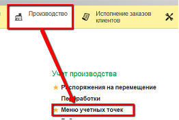
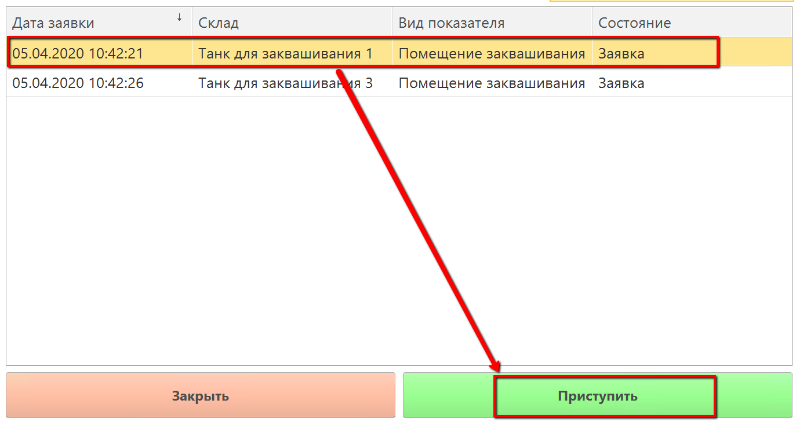
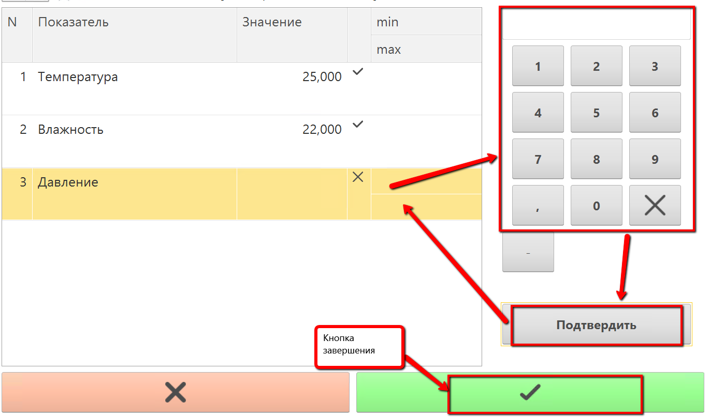

# Учет фактических значений через киоск

- Открыть «Меню учетных точек»:  

- Указать текущую дату и смену:  

- Указать учетную точку, отвечающую за участок, параметры которого
нужно учесть:  

- Нажать кнопку, соответствующую внесению показателей. Откроется
окно с заявками по этому участку. Выбрать нужную и перейти к внесению
показателей:  

- Заполнить значения каждого показателя и нажать кнопку
сохранения:  
