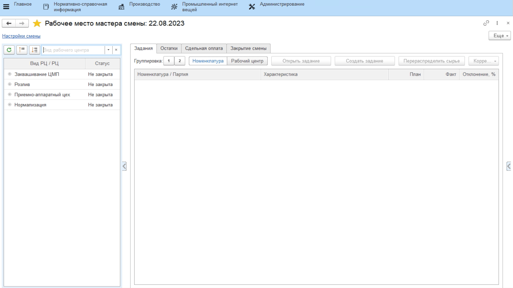
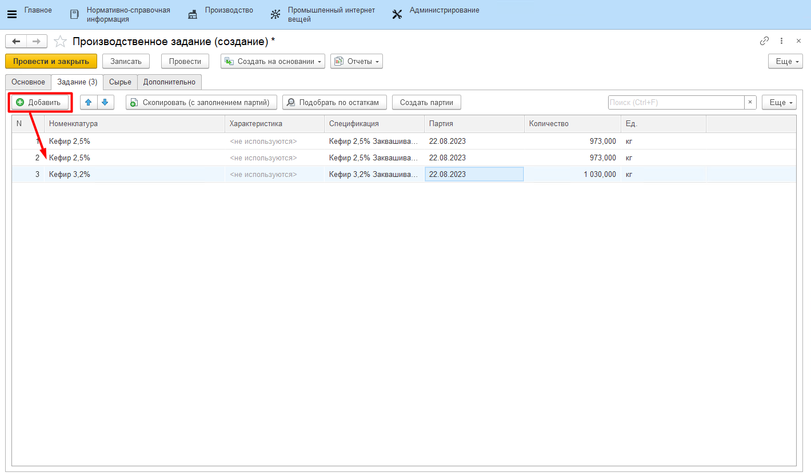

# Формирование задания на смену

В начале каждой смены мастер выдает работникам задание на заквашивание полуфабрикатов. В системе это отражается документом "Производственное задание".

-   Открыть **"Рабочее место мастера смены"**;
-   Указать смену;
-   Указать вид рабочего центра, к которому относится участок заквашивания;
-   В таблице ниже выбрать участок заквашивания;
-   На вкладке *"Задания"* нажать кнопку **"Создать задание"**. Откроется окно создания задания с заполненной информацией об участке и смене:  

-   Перейти на вкладку *"Задание"*. Здесь нужно указать все полуфабрикаты,
    которые планируется изготовить за указанную смену. Зарегистрировать партию можно по кнопке **"Создать партии"**;
 

-   Нажать **"Провести и закрыть"**.