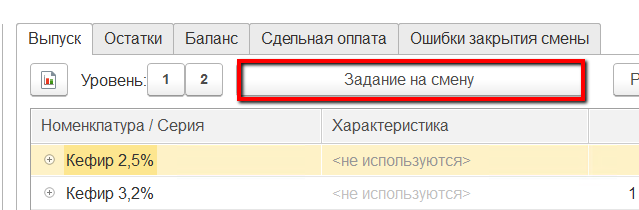
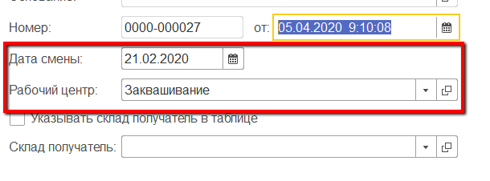
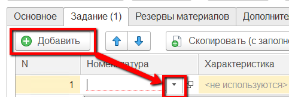
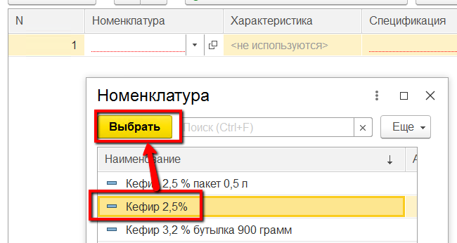
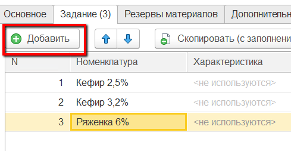

# Формирование задания на смену

В начале каждой смены мастер выдает работникам задание на заквашивание полуфабрикатов. В системе это отражается документом "Производственное задание".

-   Открыть "Рабочее место мастера смены":      

-   Указать смену:  

-   Указать участок, на котором производится заквашивание:  

-   В таблице ниже выбрать этот же участок:  
 
-   На вкладке "Выпуск" нажать кнопку "Задание на смену". Откроется окно создания задания с частично заполненной информацией:  
  

-   Перейти на вкладку «Задание». Здесь нужно указать все полуфабрикаты,
    которые планируется изготовить за указанную смену:  
  

-   Повторить предыдущий пункт для всех полуфабрикатов:  

-   Нажать "Провести и закрыть".