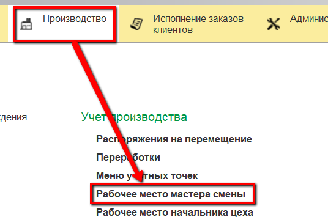
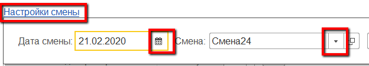
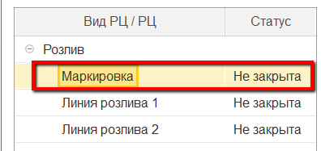
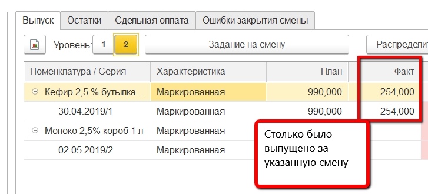
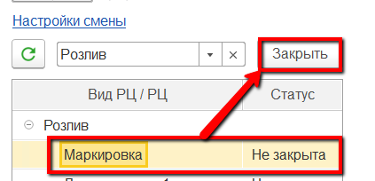

# Контроль и закрытие смены

Контроль всех введенных в систему данных за рабочую смену осуществляется
мастером смены через "Рабочее место мастера смены"

-   Открыть "Рабочее место мастера смены":      

-   Указать дату и смену:  

-   Указать участок, на котором идет розлив:  

-   Выбрать закрываемый участок в таблице ниже:  

-   Заполнится различная информация по вкладкам справа. Например, на
    вкладке "Выпуск" можно видеть все выпуски за указанную смену:  

-   После того, как все цифры проверены, смену необходимо
    закрыть, чтобы не было возможности "подправить" данные за неё. Для
    этого выбрать участок в таблице слева и нажать "Закрыть":  
