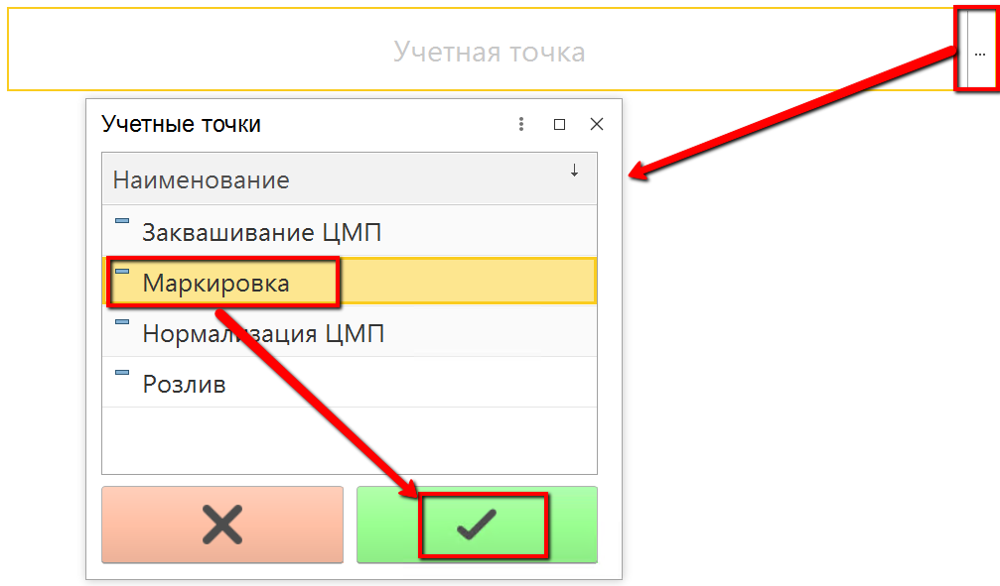

# Учет партий сырья для маркировки продукции

Разливаемая продукция может быть выпущена маркированной или нет.

В процессе выпуска маркированной продукции могут использоваться несколько партий немаркированной. Их использование нужно учитывать в системе.

-   Открыть "Меню учетных точек":  

-   Указать дату и смену, если они еще не указаны:  

-   Указать учетную точку, принадлежащую участку, где учитывается выпуск перемаркированной продукции:  

