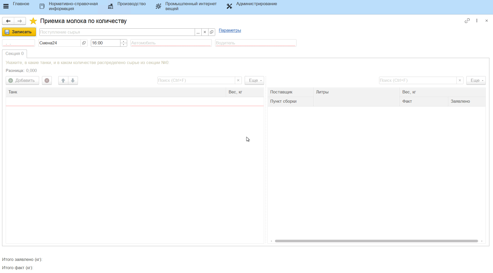

# Учет фактического количества принимаемого молока

Учет фактического количества принимаемого молока происходит через обработку **"Приемка молока по количеству"**.

-   Открыть обработку **"Приемка молока по количеству"**;
-   Выбрать документ, соответствующий машине (ориентироваться можно по времени, номеру и водителю), с которой будет сливаться молоко;

### Приемка в килограммах

Автоматически заполнятся заявленные веса по секциям.  

-   По каждой секции указать, сколько молока было перекачено в танки;
-   Нажать **"Записать"**.

Если в [соглашении с поставщиком](../DataFilling/SettingForCalculationPrices/ustanovka_tsen_i_parametrov_raschetov_tsen.md) указана опция *"Формировать акт о расхождениях"*, то при отклонении фактического веса сырья от заявленого можно будет распечатать акт.

### Приемка в литрах

Автоматически заполнятся заявленные объемы и рассчитанные веса по секциям. 

-   По каждой секции указать, сколько молока было перекачено в танки (л). Вес молока в килограммах автоматически рассчитается по указанному в [настройках](../DataFilling/RecievingInLiters/RecievingInLiters.md) показателю плотности. При этом `Вес (кг) = Объем (л) * Плотность (кг/л)`. При этом при необходимости вес в кг можно отредактировать вручную;
-   Нажать **"Записать"**.

