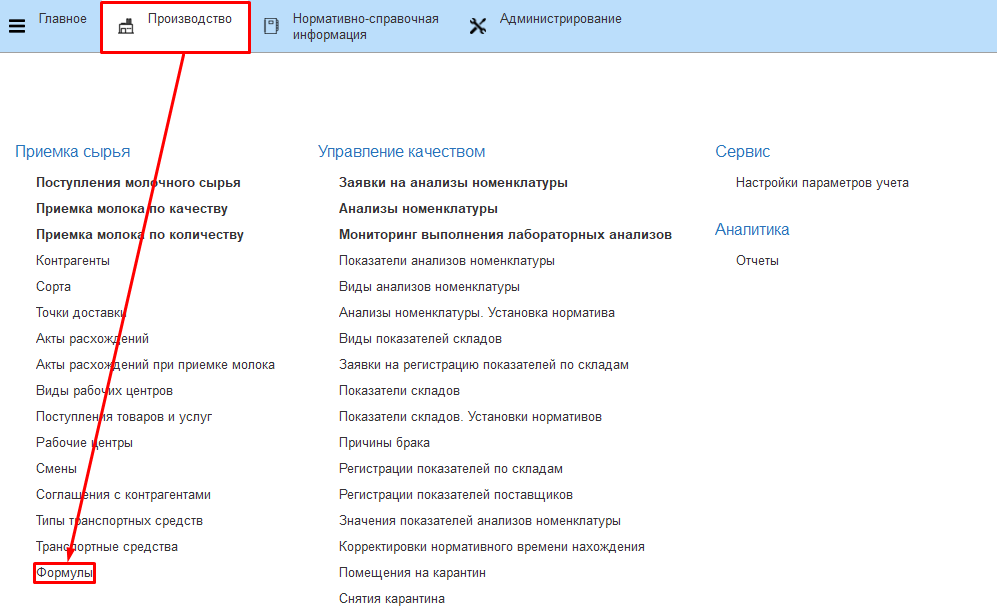
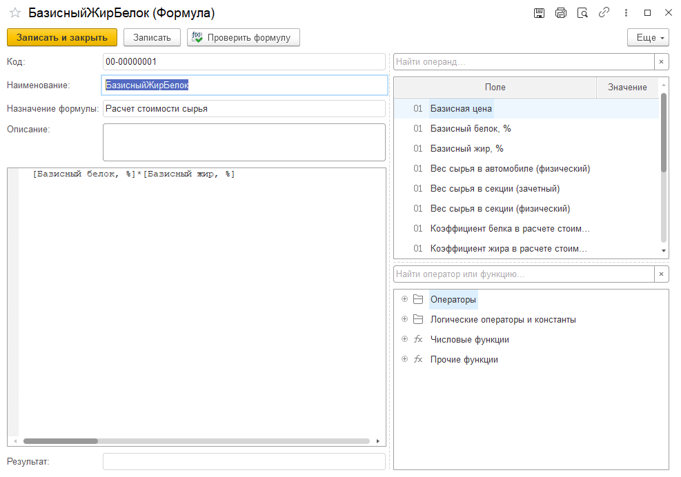
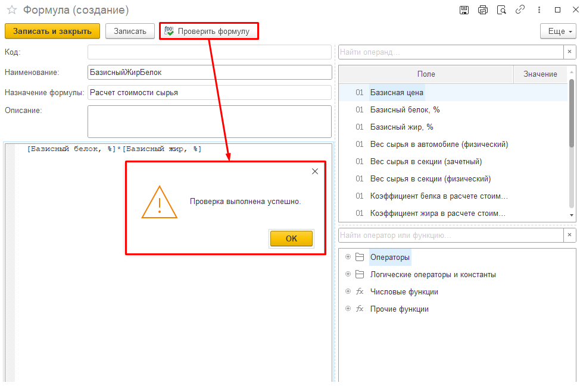

# Формулы

Все формулы отображаются в справочнике "Формулы".

 

 

-   Открыть справочник и перейти к созданию нового элемента:

-   Ввести название формулы и создать ее, используя доступные элементы в столбике справа

-   На форме создания формулы присутствует кнопка "Проверить формулу".
Нажав на неё, формула будет проверена автоматически на возможность вычисления значения.
Если формула введена верно, то будет выведено сообщение об успешной проверке.

-   Нажать "Записать и закрыть"