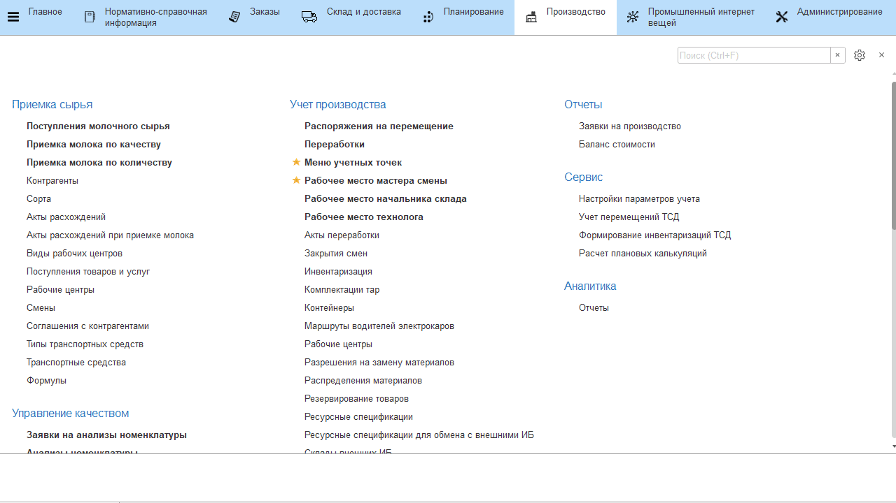
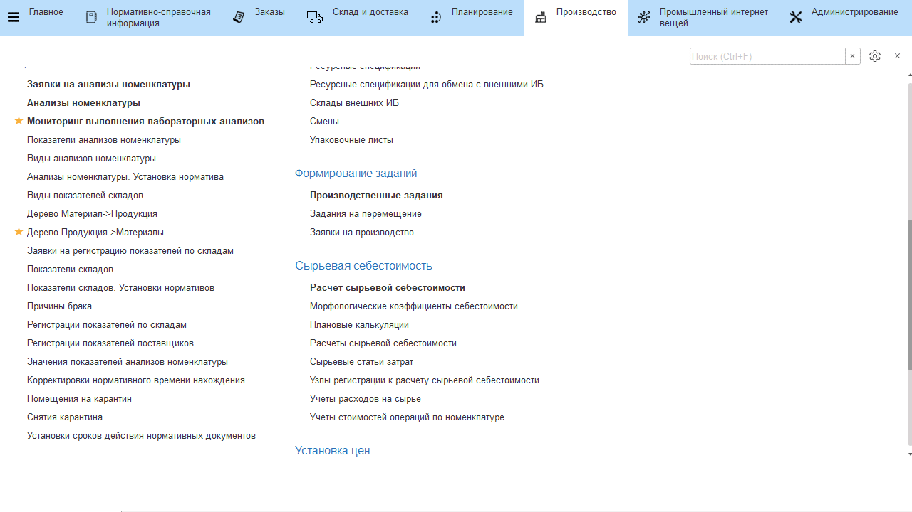

# Лабораторные анализы принимаемого молока

## Справочник "Показатели анализов номенклатуры"

Все показатели лабораторных анализов, которые учитываются при приемке молока, необходимо отразить в справочнике **"Показатели анализов номенклатуры"**.

-   Открыть справочник и перейти к созданию нового элемента;  
-   Указать наименование показателя и выбрать, к какому виду относится
    его результат:
    -   **Число целое в диапазоне** - значение показателя будет целым числом из
    заданного в дальнейшем диапазона;
    -   **Число дробное в диапазоне** - аналогично первому, но значение может
    быть дробным;  
    -   **Признак** - имеет два значения: "Да" - соответствует и "Нет" - не
    соответствует указанному признаку;   
    -   **Значение из списка** - может соответствовать одному из перечисленных в
    таблице значению;

-   Cоздаваемый показатель также может рассчитываться от
    значений других. В таком случае нужно отметить этот пункт галочкой и
    открыть окно для указания формулы;
-   В открывшемся окне указать, по какой формуле считается данный
    показатель и нажать "Записать и закрыть";
-   Нажать **"Записать и закрыть"**.

## Справочник "Виды анализов номенклатуры"

Теперь созданные показатели анализов можно объединять в наборы,
соответствующие тем группам показателей, которые по конкретной продукции
берутся вместе (на одном этапе производства). Такие наборы создаются в
справочнике **"Виды анализов номенклатуры"** (один элемент справочника =
один набор).

-   Открыть справочник и перейти к созданию нового элемента;     
-   Указать наименование набора (для удобства "\<Продукция, по которой
    берется этот набор показателей\> + \<Этап, на котором берется этот
    набор показателей\>") и в таблице перечислить все показатели,
    которые входят в набор;
-   Здесь же можно указать нормативные значения для каждого из показателей набора. Если норматив не указан, то при указании результата анализа он автоматически считается соответствующим нормативу;
-   Нажать **"Записать и закрыть"**.

