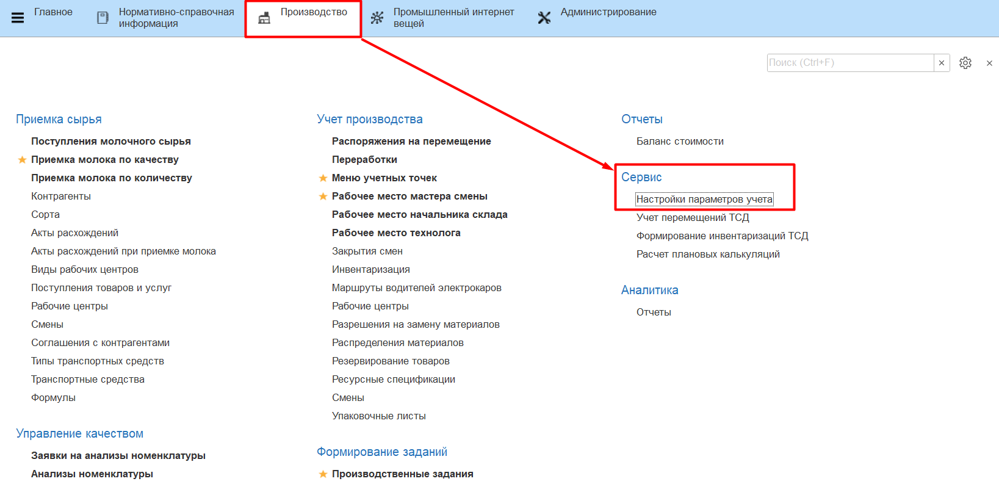
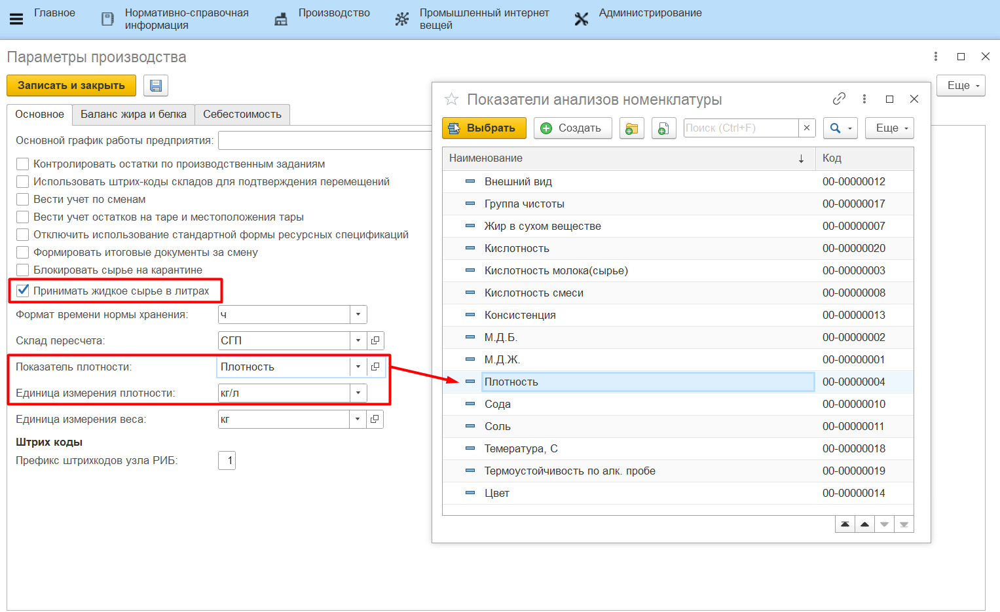

# Приемка молока в литрах

Если приемка молока проводится в литрах, а не в килограммах, необходимо задать соответствующую настройку. Для этого нужно:

- перейти в раздел Производство -> Настройки параметров учета;
- на вкладке "Основное" поставить галочку для настройки **"Принимать жидкое сырье в литрах"**;
- заполнить поле **"Показатель плотность"**, выбрав из справочника показателей анализов показатель плотности, который используется в анализе молока при приемке;
- нажать **"Записать и закрыть"**.

