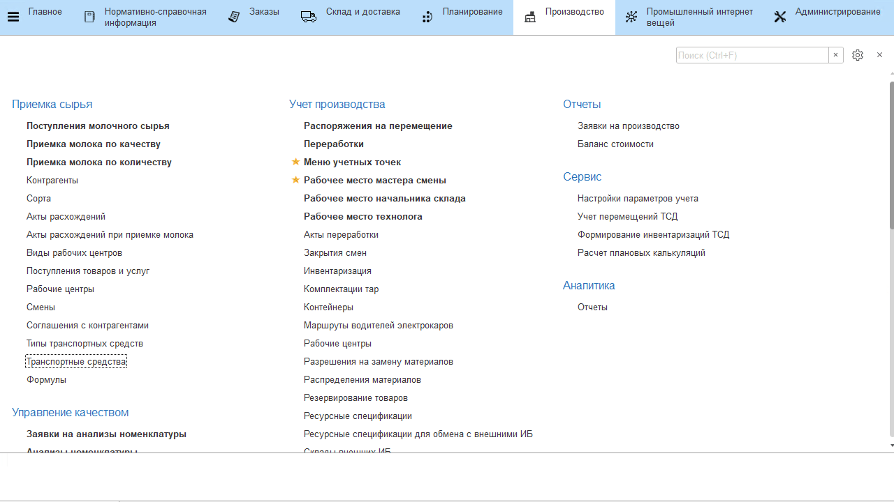
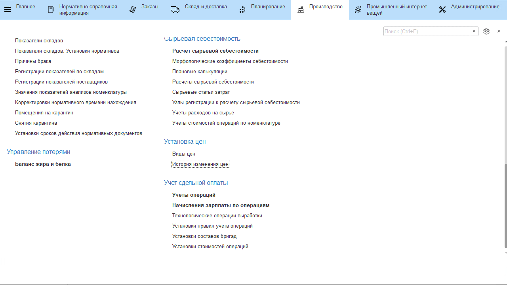
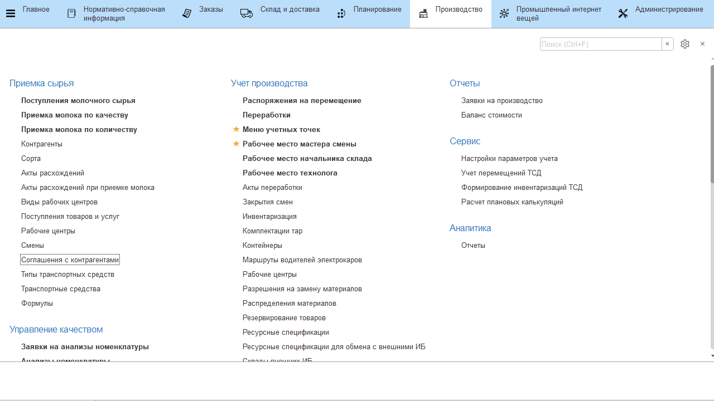

# Установка цен и параметров расчетов цен по поставщикам

Расчет стоимости поступающего молока происходит на основании следующей установленной информации в системе.


**Коэффициенты стоимости жира и белка в молоке**

Коэффициенты жира и белка в расчете стоимости сырья заполняются в **"Настройках параметров учета"**:

-   На вкладке *"Баланс жира и белка"* заполнить соответствующие поля;
-   Нажать **"Записать и закрыть"**.

  

## Справочник "Виды цен"

Для каждого поставщика нужно создать вид цены, который в дальнейшем будет определять стоимость его молока базовой жирности. 
    
-   Открыть справочник **"Виды цен"** и перейти к созданию нового элемента;
-   В поле *"Наименование"* указать, к какому поставщику относится
    создаваемый вид цены. В поле *"Валюта"* - валюта, в которой будут идти расчеты с этим поставщиком;
-   *"Цена задается"*:
    -   на номеклатуру;
    -   на характеристику;
-   Нажать **"Записать и закрыть"**;

 

**Установка стоимости молока базисной жирности**

Далее для каждого поставщика необходимо задать стоимость его молока базовой жирности.

-   Открыть список документов **"История изменеия цен"** и перейти к созданию нового;
-   В таблице перечислить цены всех поставщиков, которые будут заданы далее, и нажать **"Перейти к установке цен"**;
-   В таблицу добавить номенклатуру молочного сырья;
-   Заполнить столбцы *"Новая цена"* под каждым поставщиком соответствующей стоимостью;
-   Нажать **"Провести и закрыть"**.

 

## Соглашения с поставщиками

Для каждого поставщика задать индивидуальные условия, по которым будет считаться стоимость молока.

-   Открыть справочник **"Соглашения с контрагентами"** и перейти к созданию его нового элемента;
-   Заполнить информацию на вкладке *"Основное"*: поставщик, для которого создается это соглашение, наша организацию. Установить статус "Действует";
-   На вкладке *"Ценовые условия"* указать валюту, в которой ведутся расчеты, и выбрать вид цены, соответствующий поставщику; 
-   На вкладке *"Условия поставки"* указать, каким образом учитывать отклонения фактических значенений от заявленных поставщиком при приемке:  
    - Формировать акт о расхождениях;
    - Списать на себестоимость;
-   Также, здесь можно задать индивидуальные условия расчета стоимости сырья. Для этого поставить галочку "Использовать индивидуальные условия";
-   Выбрать способ расчета стоимости сырья:
    -   стандартный - по жиру и белку, т.е. при расчете стоимости молока будет учитываться содержание и белка, и жира в молоке;
    -   только по жиру - в этом случае содержание белка в молоке игнорируется;
    -   по формуле;
-   Указать базу расчета стоимости сырья:
    -   по физическому весу - тогда стоимость будет считаться как  
    ```
    вес принятого молока * стоимость молока базовой жирности этого поставщика *
    коэффициент сорта * коэффициент, учитывающий содержание жира (или жира и белка, в зависимости от указанного выше условия), коэффициенты жира и белка, заданные в параметрах учета, и нормативы содержания их в молоке базовой жирности
    ```
    -   по зачетному весу - тогда стоимость будет считаться как  
    ```
    стоимость молока базовой жирности поставщика * зачетный вес, который считается как физический вес * коэффициент сорта * коэффициент, учитывающий содержание жира (или жира и белка, в зависимости от указанного выше условия), коэффициенты жира и белка, заданные в параметрах учета, и нормативы содержания их в молоке
    базовой жирности
    ``` 
-   Задать способ округления (для зачетного веса) и точность округления при расчетах;
-   В табличной части *"Коэффициенты в расчете стоимости"* можно задать индивидуальные коэффициенты каждого сорта (либо же оставить таблицу пустой, тогда будут использованы общие коэффициенты). В таблице *"Применяется к сырью"* указывается, для какого сырья используются введенные коэффициенты;
-   Нажать **"Записать и закрыть"**.

 