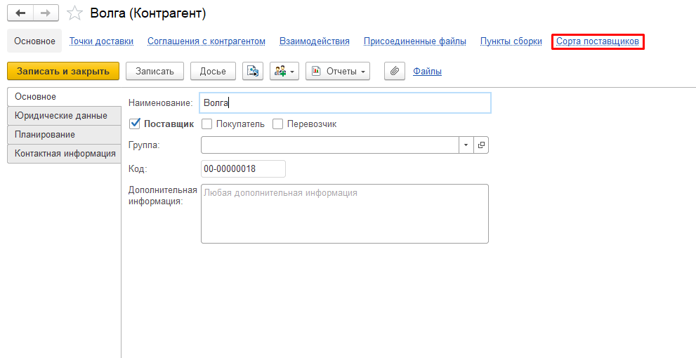
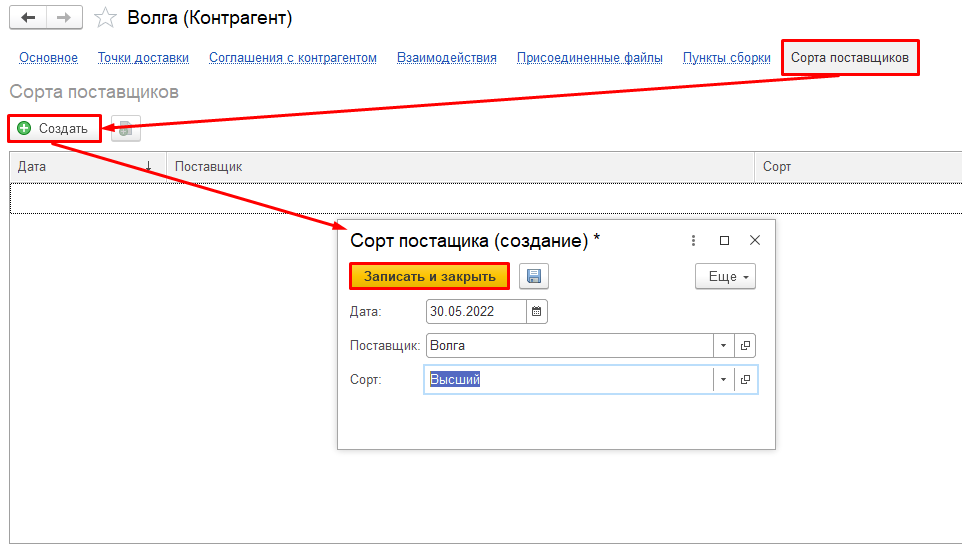

# Установка сортов по поставщикам на период

Иногда лабораторные анализы берутся не по всем принимаемым машинам. В
этом случае для поставщиков устанавливается поставляемый им сорт в
регистре сведений "Сорта поставщиков". Сорт молока будет определяться
именно на основании значения этого регистра.

 

-   Открыть нужного поставщика и перейти во вкладку "Сорта поставщиков":

 
-   Указать поставщика и сорт для него:

  
-   Нажать "Записать и закрыть".

