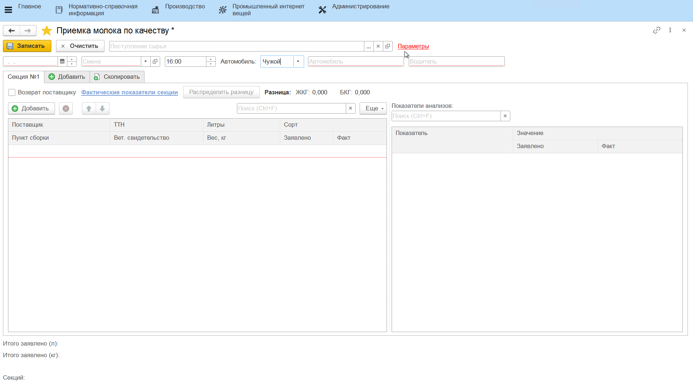
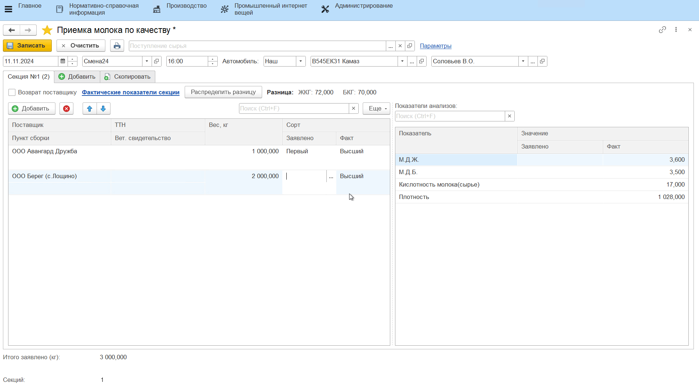
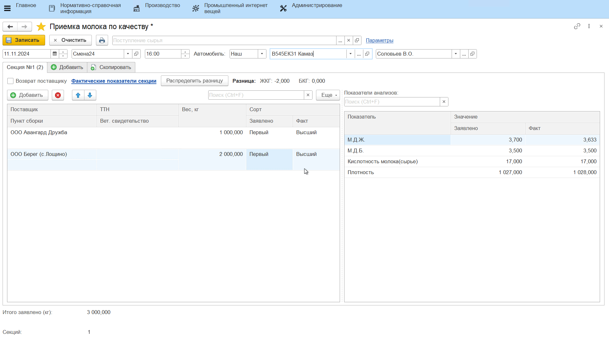

# Учет лабораторных анализов сырья

Учет лабораторных анализов принимаемого молока происходит через обработку **"Приемка молока по качеству"**.

- Открыть обработку **"Приемка молока по качеству"**;
- В параметрах указать, какой вид анализа в системе включает в себя все показатели принимаемого молока, на основании которых определяется его сорт (если он еще не указан);
- По гиперссылке *"Параметры"* также необходимо указать номенклатуру, отвечающую за принимаемое сырье и участок, на котором происходит приемка молока;  
- На основной вкладке заполнить информацию о текущей смене, указав дату и смену, и о принимаемой машине с молоком, указав номер и водителя;

### Приемка в килограммах

После того, как заполнена информация о смене и машине, необходимо:

- Заполнить информацию по первой секции (добавить всех поставщиков, чье молоко находится в ней, их ТТН, вет.свидетельства);
- Указать заявленный поставщиком вес принимаемого молока;
- Внести значения показателей принятого молока с данной секции, нажав **"Фактические показатели секции"**. Заполнить значение каждого из показателей в открывшейся форме и нажать **"ОК"**;
 
Автоматически определяется сорт молока.  
    

-   При необходимости внести заявленные показатели по каждому поставщику
    в секции, нажав в поле **"Заявлено"** и заполнив схожую с предыдущим
    пунктом форму;
-   Если заявленные и полученные показатели разнятся, можно распределить
    эту разницу между поставщиками, нажав **"Распределить разницу"**;
    

Аналогично заполнить информацию по остальным секциям в машине.  

- В случае обнаружения некачественного молока в какой-либо из секций машины, при заполнении информации по этой секции установить галочку **"Возврат поставщику"**:

- Нажать **"Записать"**. Даже если выведется сообщение о том, что сорт не удалось определить, при записи данные сохранятся.
- При необходимости можно распечатать **"Акт о расхождениях"**, куда подтянется разница по заявленным и фактическим показателям по секциям:

### Приемка в литрах

Если приемка молока ведется в литрах, то при заполнении данных по поставщику необходимо указать заявленный объем молока в литрах. Вес молока в килограммах автоматически рассчитается по указанному в [настройках](../DataFilling/RecievingInLiters/RecievingInLiters.md) показателю плотности. При этом `Вес (кг) = Объем (л) * Плотность (кг/л)`. 

