# Работа с заявками на лабораторные анализы

Работа с заявками на лабораторные анализы происходит через меню учетных точек

- Нужно заполнить поля: даты, смены, учетной точки и выбрать по каким анализам будет осуществляться работа, нажав на соответствующую кнопку

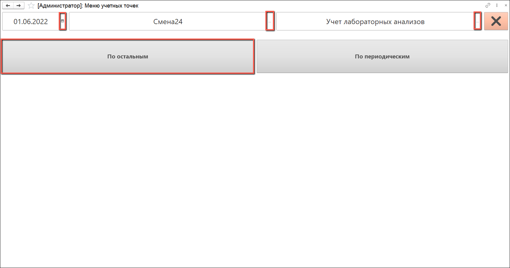

- Выбрать номенклатуру с нужным видом анализа и нажать "Приступить"

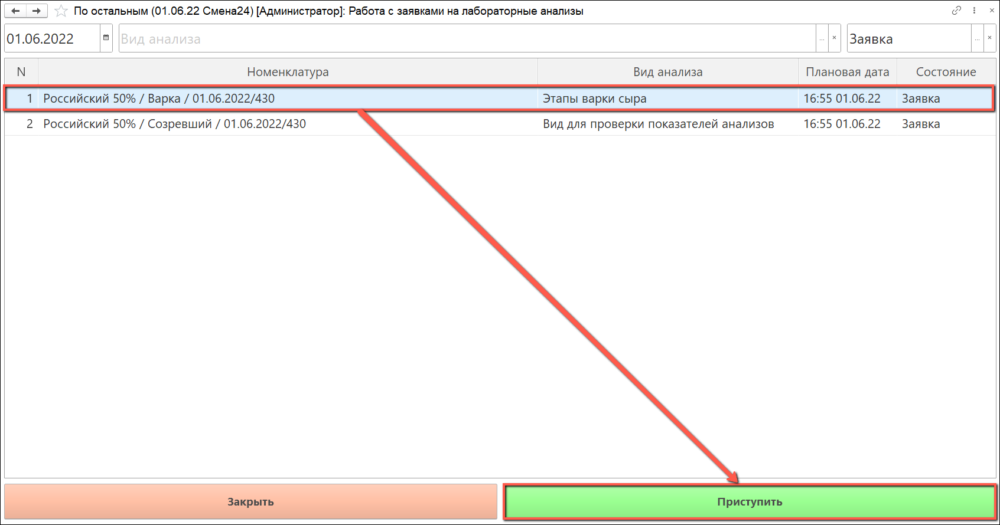

- Открылось окно со всеми показателями, которые принадлежат данному виду: "Этапы варки сыра"

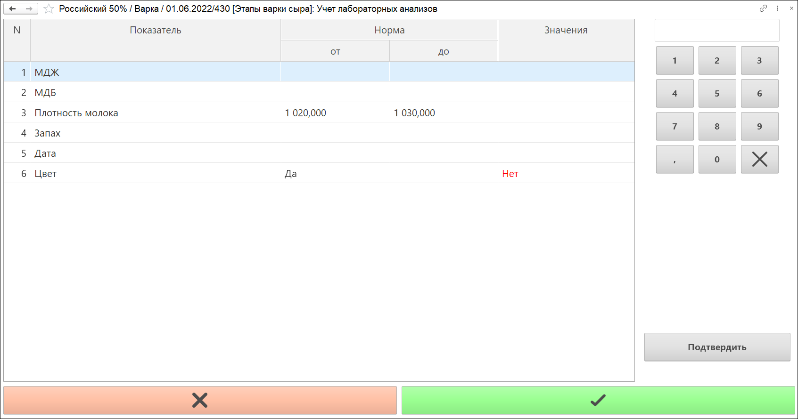

Значения показателей могут быть представлены в виде:

  - диапазона дробных чисел

  - диапазона целых чисел

  - значений из списка, которые задаются в справочнике "Значение показателей анализов номенклатуры"

  - даты

  - признака с переключаемым тумблером "да/нет"

Каждый показатель можно настроить и закрепить за ним значение

- Значения показателей МДЖ и МДБ можно заполнить дробными числами с помощью калькулятора.
Выбираем строку, вписываем значение и нажимаем "Подтвердить"

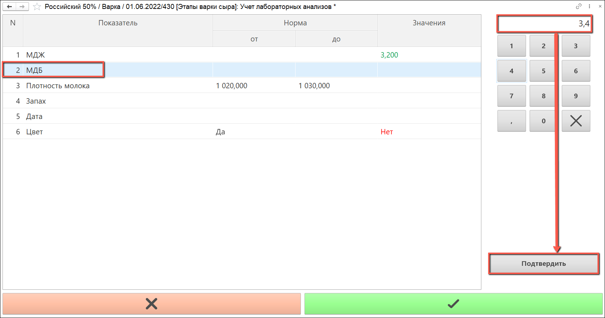

- Значение плотности может быть заполнено целыми числами. При попытке вписать дробное, запятая не будет проставляться

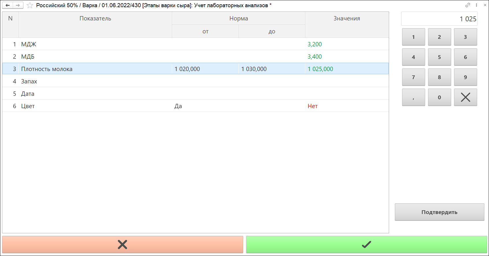

- Для запаха выводится список значений, из которых можно выбрать только одно

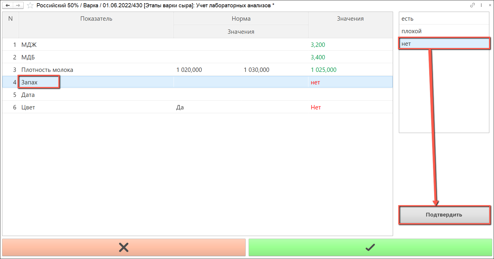

- Для даты выводится калькулятор, в котором можно ввести нужную для отображения дату, либо можно воспользоваться 
кнопкой "Текущая дата" и тогда поле автоматически заполнится текущим временем

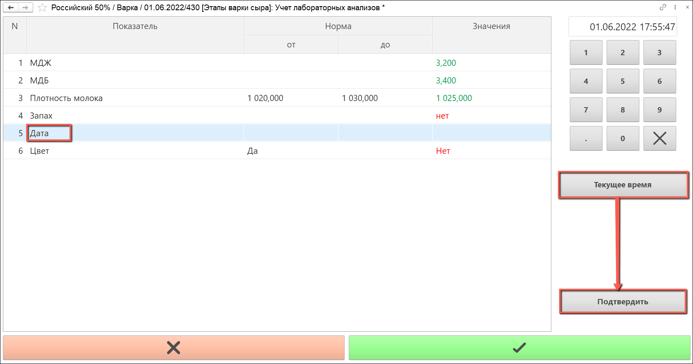

- При выборе цвета появится тумблер с двумя кнопками

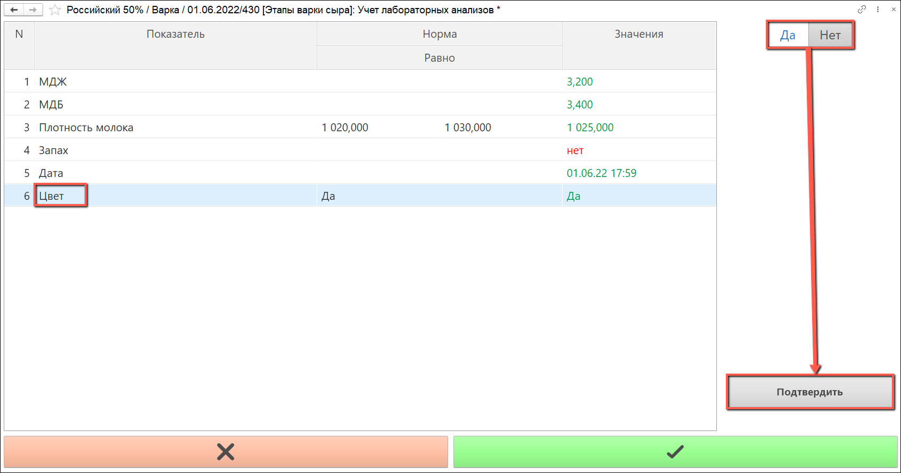

- После внесения всех данных нажать на зелёную кнопку, которая всё сохранит

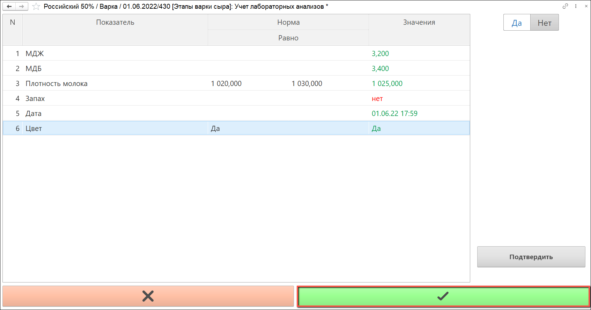

- Также можно отследить выполненные заявки, для этого нужно выбрать соответствующий пункт в контекстном меню

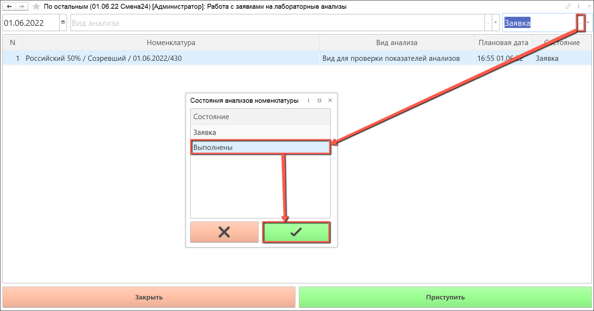

- Появится номенклатура, по которой был выполнен анализ

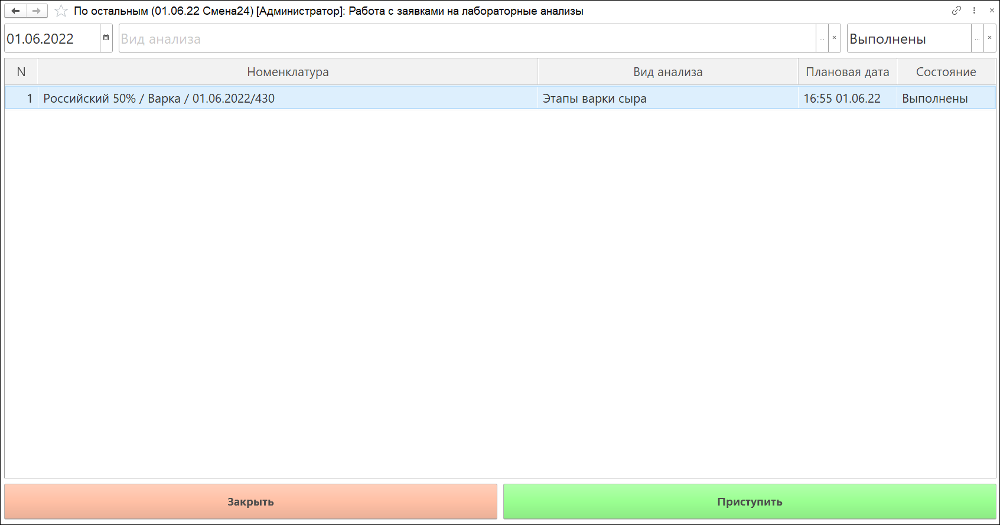