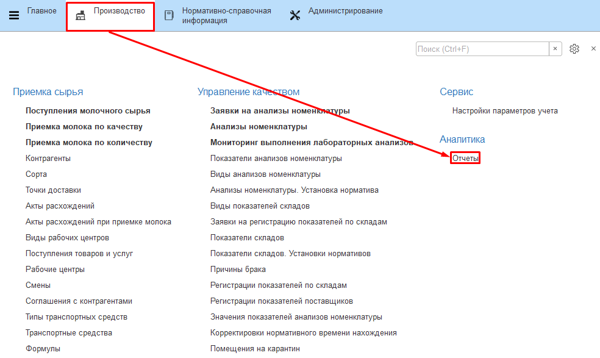
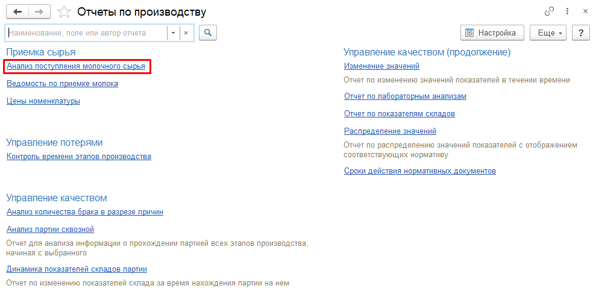
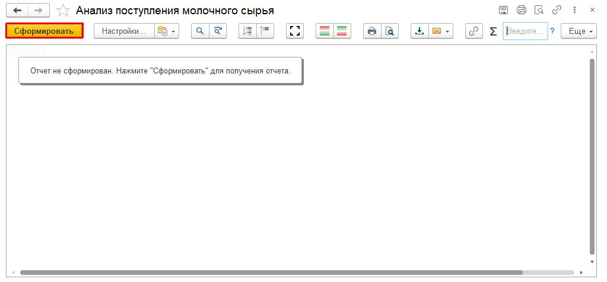
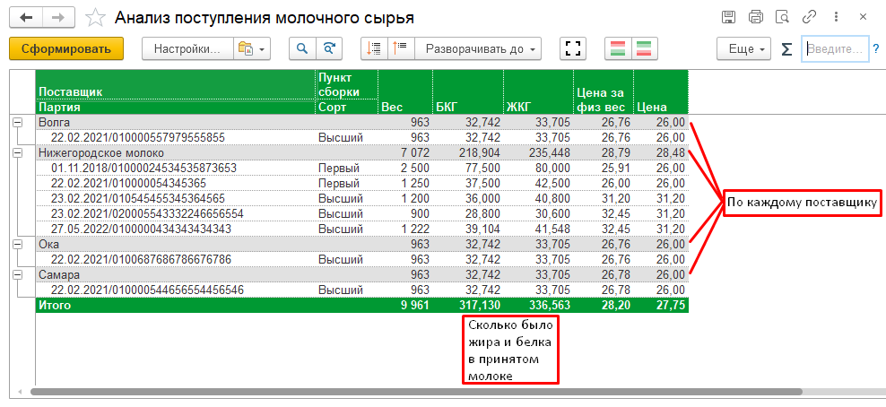

# Мониторинг поступления сырья

Информацию по принятому молоку можно посмотреть в отчете "Анализ
поступления сырья".

-   Открыть все отчеты подсистемы "Производство":

   
-   Открыть отчет "Анализ поступления молочного сырья":

   
-   Cформировать:

   
-   За указанный период в отчете предоставляется следующая информация:
    -   Куда, когда и от кого было принято молоко;
    -   Сколько было принято в кг, жирокилограммах и белкокилограммах;
    -   Цена и итоговая стоимость.

