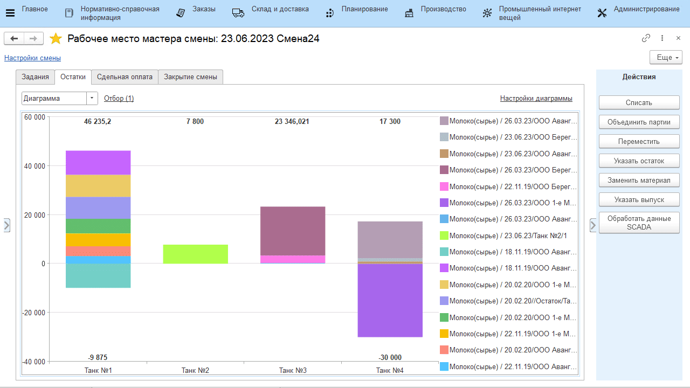

# Указание остатков молочного сырья на конец дня

Мастер через свое рабочее место в конце смены должен указать, в каком танке сколько молока осталось.

-   Открыть **"Рабочее место мастера смены"**;
-   Указать дату смены и смену;  
-   Указать участок приемно-аппаратного цеха;
-   В таблице ниже выбрать участок, на котором хранится принятое сырье;  
-   На вкладке *"Остатки"* отображается информация по
    оборотам молока в каждом танке. Выбрать нужный танк и нажать **"Указать остаток"**;
-   Указать, сколько килограмм сырья осталось, какие показатели жира и белка у
    остатка, и подтвердить:  
    
В диаграмме появится новый блок, соответствующий остатку.

