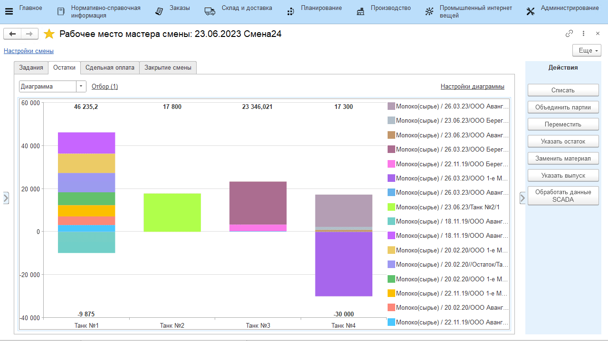

# Передача молока на сепарацию/нормализацию

Передача молока на сепарацию\\нормализацию выполняется мастером цеха
через его рабочее место.

Но также есть возможность настройки интеграции MES-системы с АСУТП (если
на предприятии имеется соответствующее оборудование), и в этом случае
получение и обработка данных для передачи молока на следующие операции
будет происходить без участия человека.

-   Открыть **"Рабочее место мастера смены"**;
-   Указать дату смены и смену;
-   Указать участок приемно-аппаратного цеха; 
-   Выбрать участок, на котором принимается молоко; 
-   Перейти на вкладку *"Остатки"*; 
-   Выбрать танк и партию молока, которая будет передаваться и нажать
    **"Переместить"**; 
-   Указать, куда будет передано молоко (на сепарацию или нормализацию)
    и в каком количестве и подтвердить:

