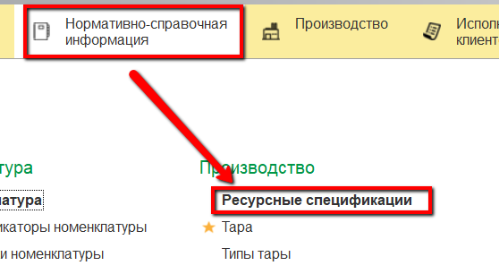
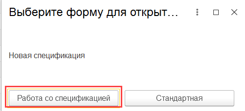
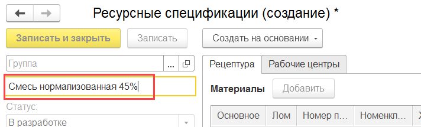
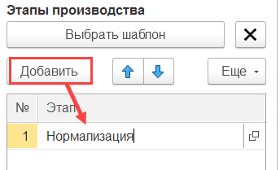
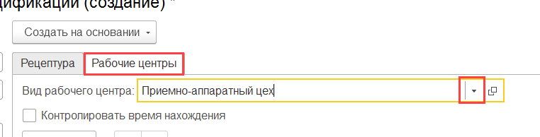
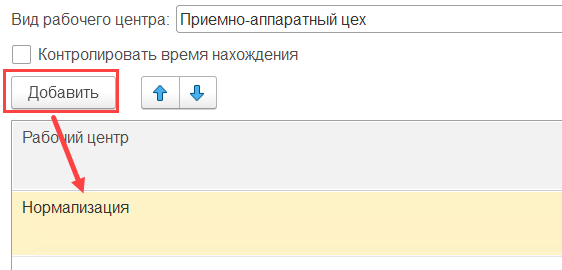
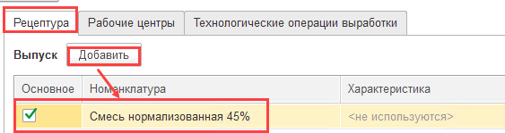
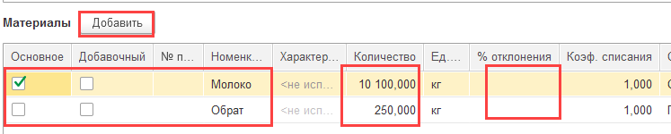
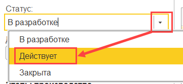

**Рецептуры**
=============

Рецептуры по нормативному расходу сырья на этапе нормализации молока
задаются в справочнике "Ресурсные спецификации". При этом на
нормализованное молоко разной жирности задаются разные рецептуры.

 

-   Открыть справочник и перейти к созданию нового элемента, выбрав
    создание через форму "Работа со спецификацией" (выбор может быть отключен, сразу откроется форма создания рецептуры):  
  

    
- Указать наименование - продукция, на которую задается рецептура:  
  

-   Добавить новый этап в таблице этапов, указать его наименование:  
    
    
-   Перейти на вкладку "Рабочие центры". Указать вид рабочего центра для этапа рецептуры:

  

-   В таблице рабочих центров перечислить все участки, относящиеся к указанному этапу производства, т.е. те, на которых этот этап может протекать:  

    
-   Перейти на вкладку "Рецептура". В  таблицу "Выпуск" добавить продукцию, на которую задается рецептура, отметив ее основной. Указать выходное количество - по рецептуре:  
    

-   В таблице "Материалы" указать все материалы, следуя рецептуре, их количество и возможный процент отклонения от этого количества в обе стороны.  Отметить основной материал - галочкой "Основное":  
    
    
- Установить дату начала действия рецептуры, опционально - окончания:

  

- Установить статус "Действует":  
  

- Нажать "Записать и закрыть".