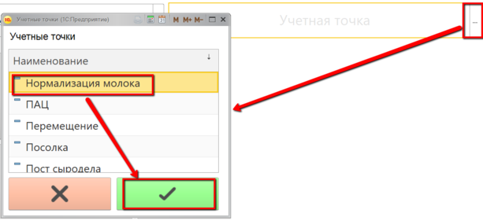
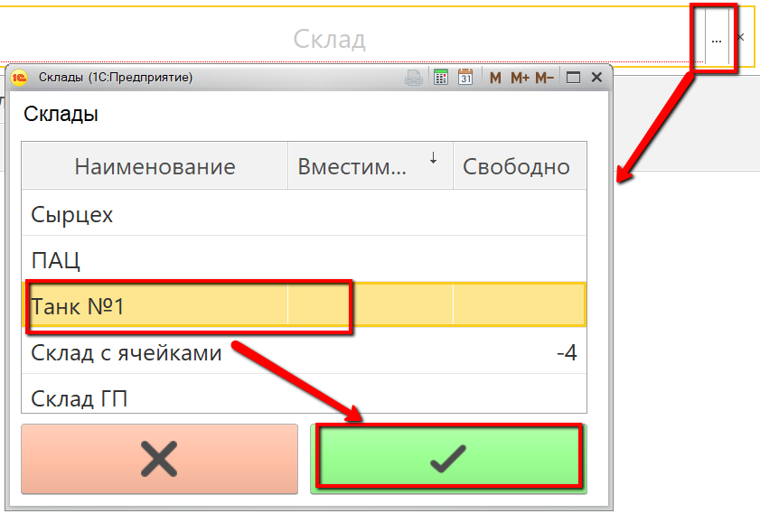
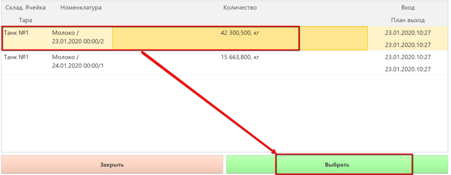
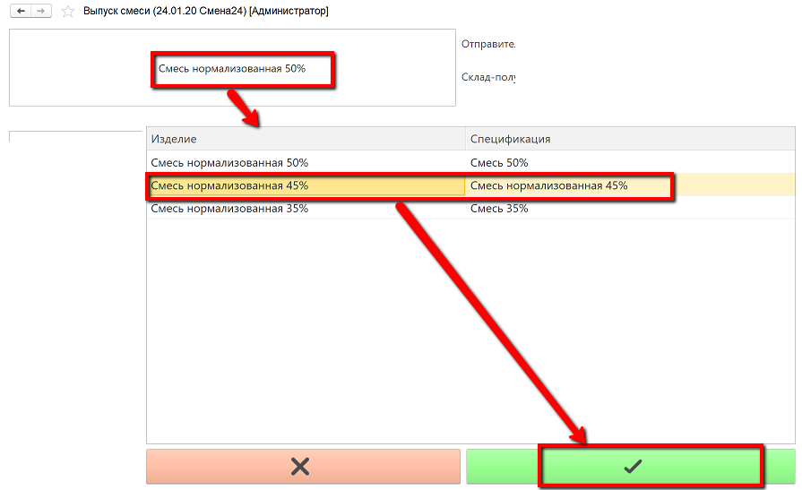
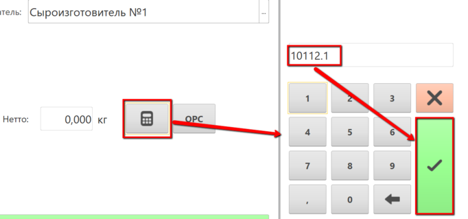

# Выпуск через киоск по факту готовности

Выпуск нормализованного молока по факту в системе происходит через
учетную точку, привязанную к участку, где нормализуется молоко.

 

 

-   Открыть "Меню учетных точек" :  

-   Указать текущую дату и смену, если они еще не указаны:  

-   Указать учетную точку, которая соответствует участку нормализации
    молока:  

-   Нажать кнопку, соответствующую выпуску смеси. В открывшейся форме
    указать склад, с  которого было получено молоко для смеси:  

-   Отобразятся все остатки молока на выбранном складе. Выбрать партию
    молока, которое использовалось для выпуска смеси и нажать "Выбрать":  

-   Указать, какая смесь получилась:  

- Указать,куда передали смесь и сколько её получилось:  

-   Подтвердить, нажав кнопку с галочкой.

