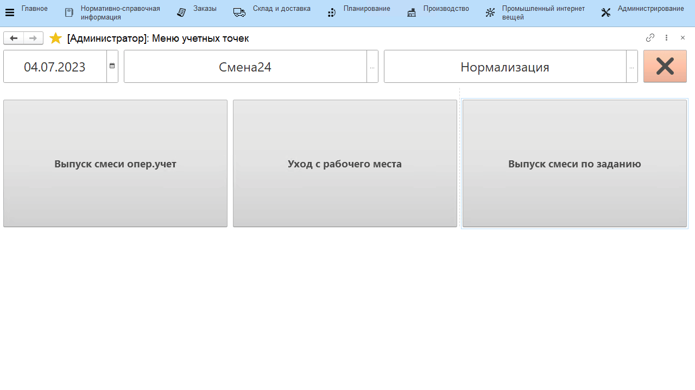

# Выпуск через киоск по заданию

Выпуск нормализованного молока по заданию в системе происходит через учетную точку, привязанную к участку, где нормализуется молоко.

-   Открыть **"Меню учетных точек"**;
-   Указать текущую дату и смену, если они еще не указаны;
-   Указать учетную точку, которая соответствует участку нормализации молока;
-   Нажать кнопку, соответствующую выпуску смеси. Отобразится задание на выпуск смесей в производственном порядке. Нажать на первую и нажать **"Приступить"**;
-   Указать, с какого танка было взято молоко (если в настройках кнопки учетной точки выбран тип распределения сырья кроме "не распределять") и сколько нормализованной смеси получилось;
-   Подтвердить, нажав кнопку с галочкой.

