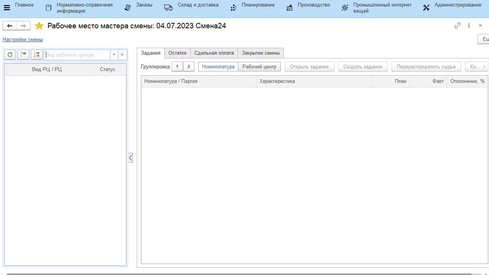
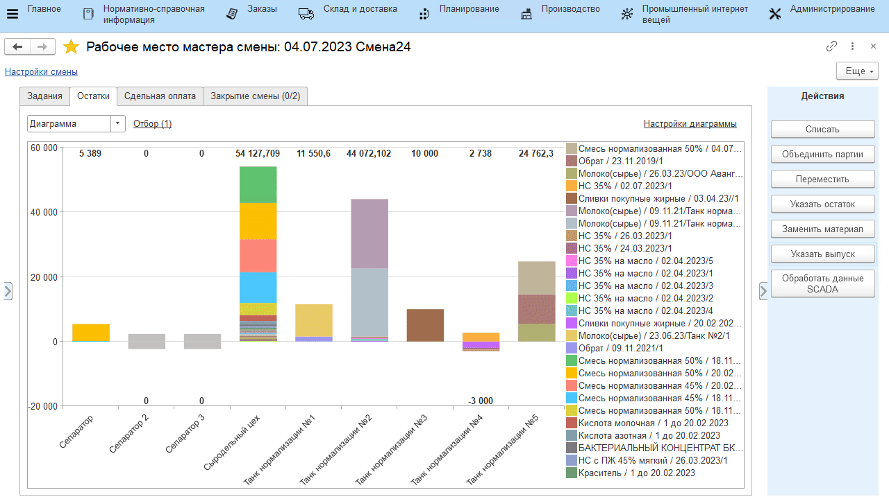

# Выпуск мастером смены

Выпуск нормализованного молока в системе также может отразить и мастер смены через свое рабочее место.

-   Открыть **"Рабочее место мастера смены"**;
-   Указать дату смены, смену и вид рабочего центра, к которому относится участок нормализации молока;
-   Выбрать участок нормализации;
-   Перейти на вкладку *"Остатки"*;  
-   Переключиться в режим диаграммы для более удобного просмотра
    остатков;

Видно, что по учету в системе в танке отображаются обрат и молоко.

-   Выбрать этот танк;
-   Нажать **"Указать выпуск"**;
-   Указать, какая продукция была получена, в каком количестве;
-   Указать, что при этом весь обрат и все молоко, что было в танке,
    пошло на эту смесь, и подтвердить;

В танке получилась смесь.

