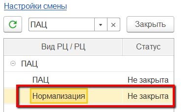
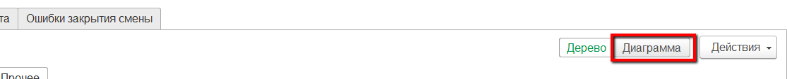
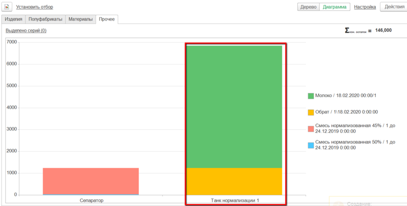
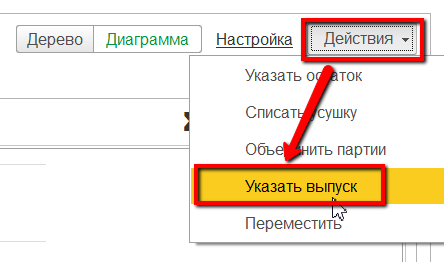
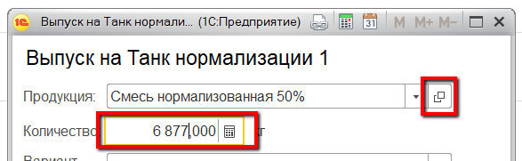
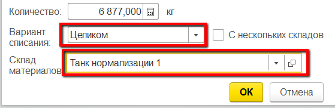
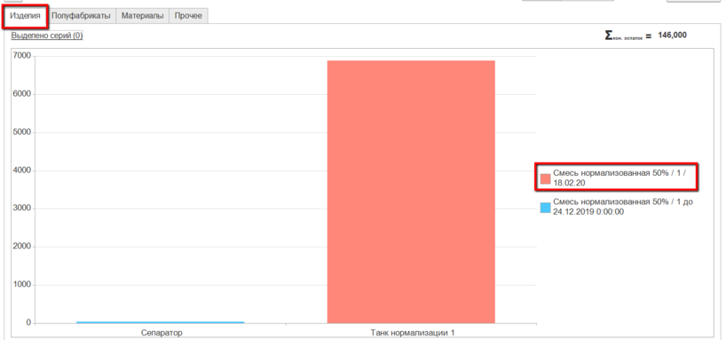

# Выпуск мастером смены

Выпуск нормализованного молока в системе также может отразить и мастер
смены через свое рабочее место.

 

 

-   Открыть "Рабочее место мастера смены":  

-   Указать дату смены, смену и участок приемно-аппаратного цеха:  
  

-   Выбрать участок нормализации:  

-   Перейти на вкладку "Остатки" -\> "Прочее" (или "Материалы", в
    зависимости от того, как настроен учет в системе):  
 
-   Переключиться в режим диаграммы для более удобного просмотра
    остатков:  
 
-   Увидеть, что по учету в системе в танке отображаются обрат и молоко.
    Зная, что из этих продуктов была получена смесь, выбрать этот танк:  
 
-   Нажать "Указать выпуск":  

-   Указать, какая продукция была получена, в каком количестве:  

-   Указать, что при этом весь обрат и все молоко, что было в танке,
    пошло на эту смесь, и подтвердить:  

-   Увидеть, что теперь в танке получилась смесь:  

