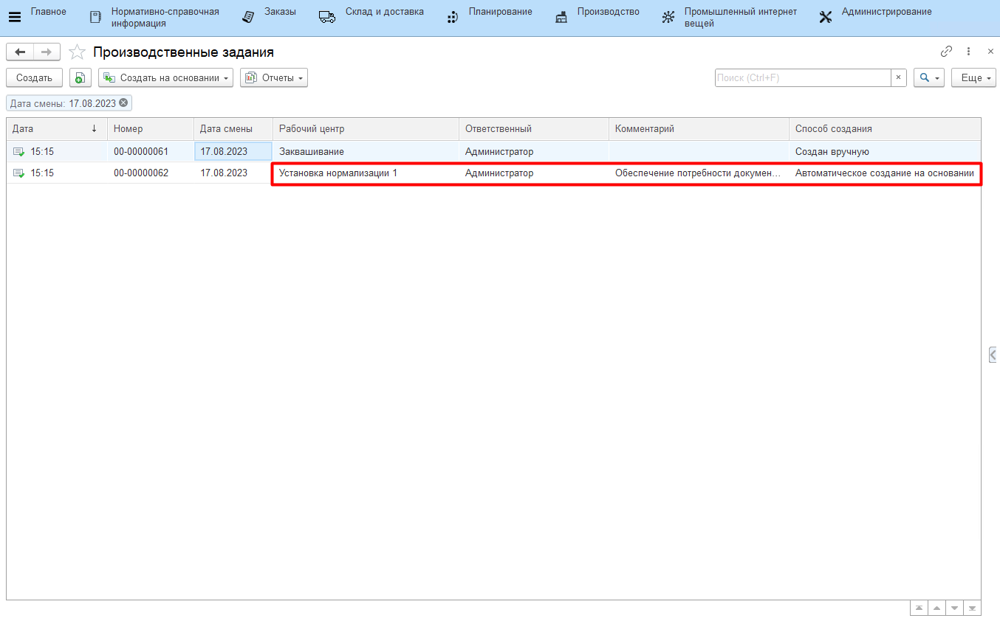

# Формирование задания на смену

Задание на смену на выпуск смеси формируется автоматически при создании задания на заквашивание (см. [Сквашивание. Формирование задания на смену](../../Fermentation/TaskForShift/TaskForShift.md)).

Если открыть документы **"Производственное задание"**, то можно видеть, что к документу, соответствующему заданию на заквашивание, всегда идет аналогичный документ с тем же временем создания, но он создан автоматически, а не вручную.

  

Это задание для участка, где нормализуется смесь, при этом номера партий смесей соответствуют номерам партий сквашиваемых полуфабрикатов. Т.е. под каждый указанный в задании на заквашивание полуфабрикат идет отдельная сторока задания на производство смеси в соответствии с основной спецификацией.