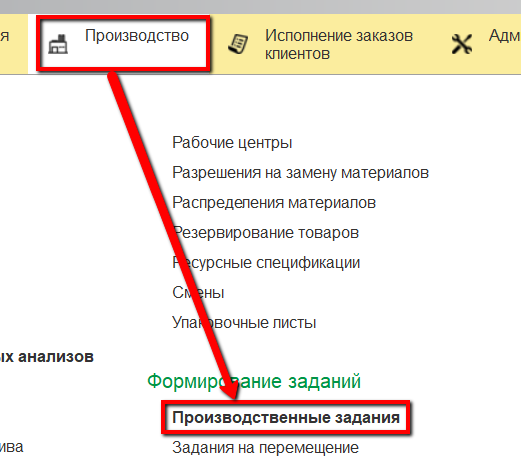
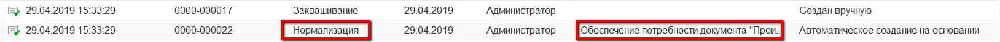
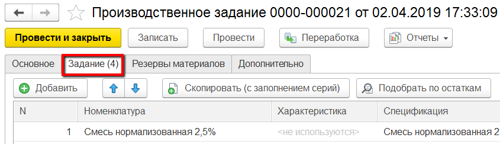
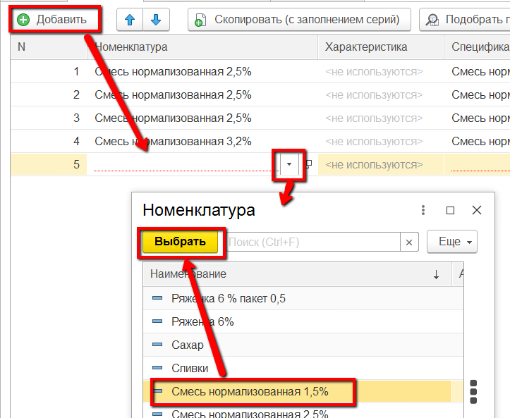

# Формирование задания на смену

Задание на смену на выпуск смеси формируется автоматически при создании
задания на заквашивание (см.[Заквашивание. Формирование задания на смену](../../Fermentation/TaskForShift/TaskForShift.md)).

 

 

-   Если открыть документы "Производственное задание":  
  
то можно видеть, что к документу, соответствующему заданию на заквашивание, всегда идет аналогичный документ с тем же временем создания,
    но он создан автоматически, а не вручную.
  

Это задание для участка, где нормализуется смесь, при этом номера
    партий смесей соответствуют номерам партий сквашиваемых полуфабрикатов. Т.е. под каждую
    указанный в задании полуфабрикат идет отдельная сторока задания для
    выработки смеси в соответствие со спецификацией.

- При необходимости (если нужно выработать молоко для розлива другой жирности) дополнить задание. Для этого открыть документ на участок нормализации и перейти к вкладке "Задание":

- Нажать "Добавить". Выбрать, какое еще молоко нужно выработать (если в таблице задания еще нет молока нужной жирности):  

- Нажать "Провести и закрыть".ы