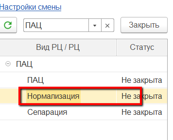
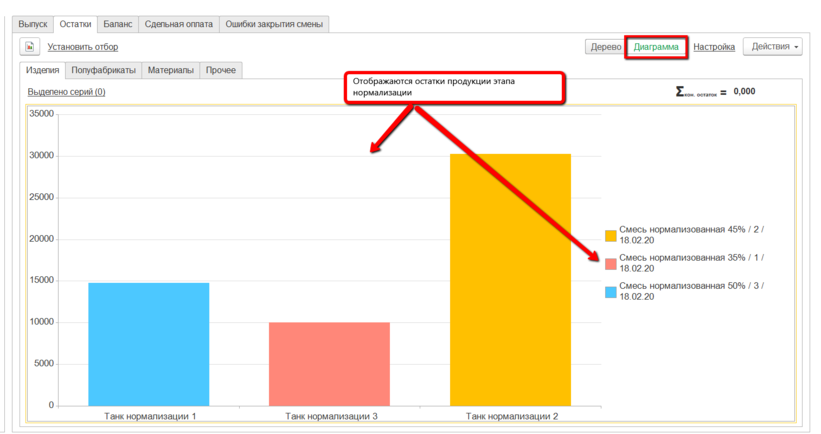
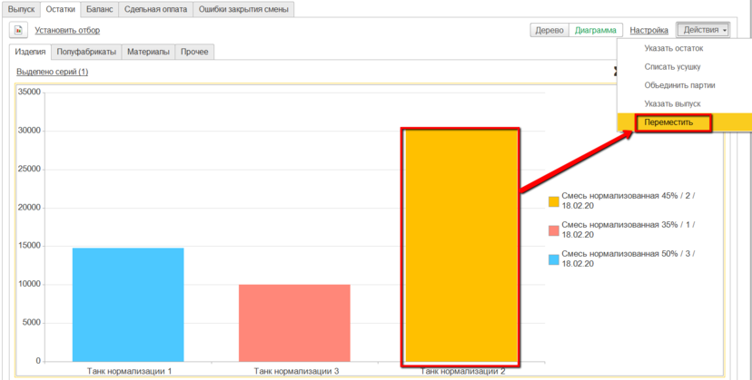
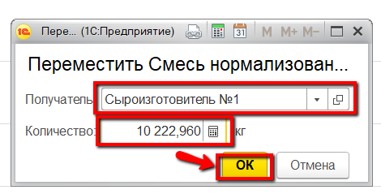

# Передача молока в сыроизготовитель

Передача смеси в сыроизготовители осуществляется мастером смены через
"Рабочее место мастера смены"

 

 

-   Открыть "Рабочее место мастера смены":  

-   Указать смену и участок, на котором нормализуется молоко:  
  

-   В таблице ниже выбрать участок нормализации молока:  

-   На вкладке "Остатки" -\> "Изделия" отображается информация по
    оборотам нормализованного молока в каждом танке.
    Для просмотра только остатков (по данным системы) можно
    переключиться в режим диаграммы.  

-   Для передачи смеси в сыроизготовители нужно выбрать танк, с которого
    будет передана смесь, и нажать "Переместить":  

-   В открывшейся форме указать, сколько и в какой сыроизготовитель
    передается смеси, и подтвердить:  
