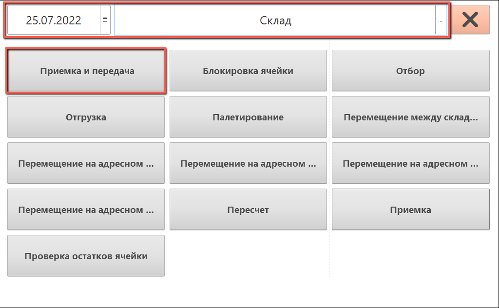
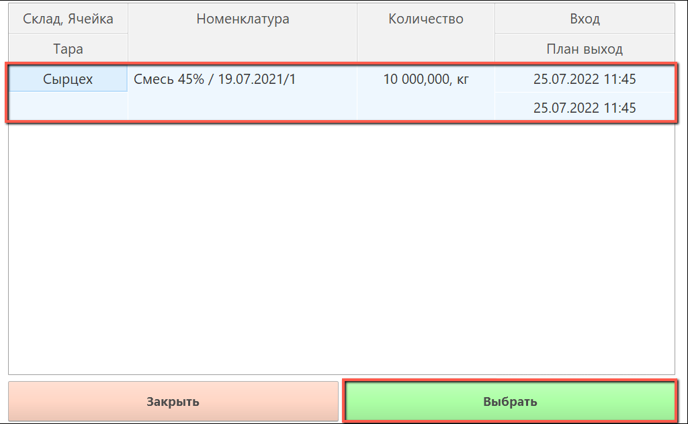
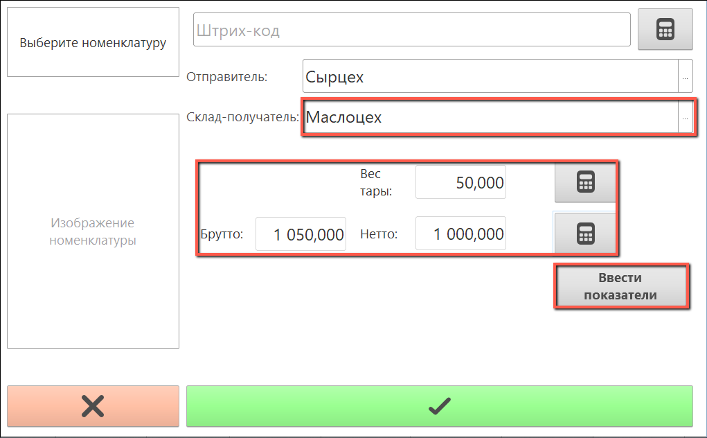
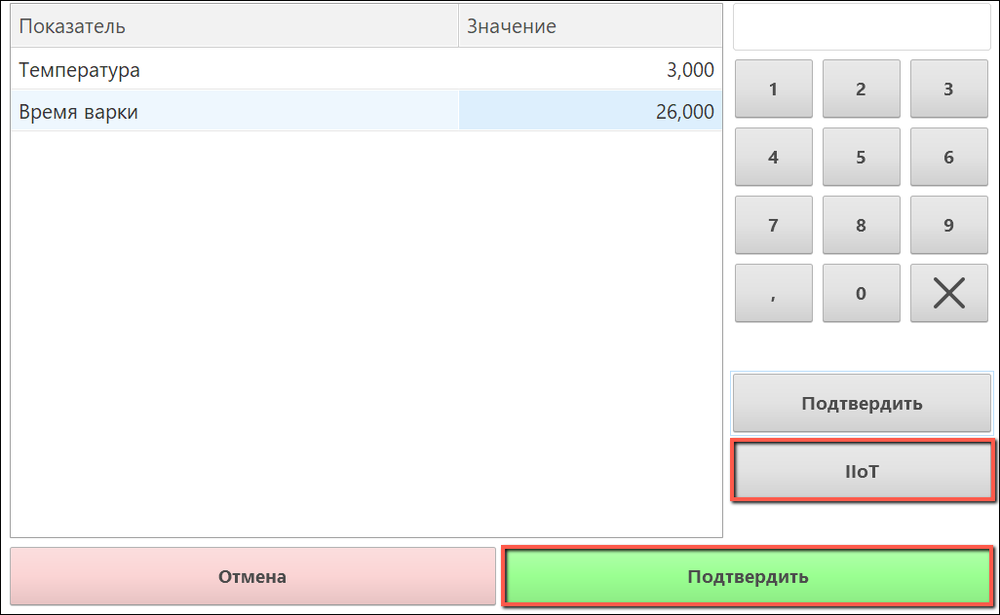
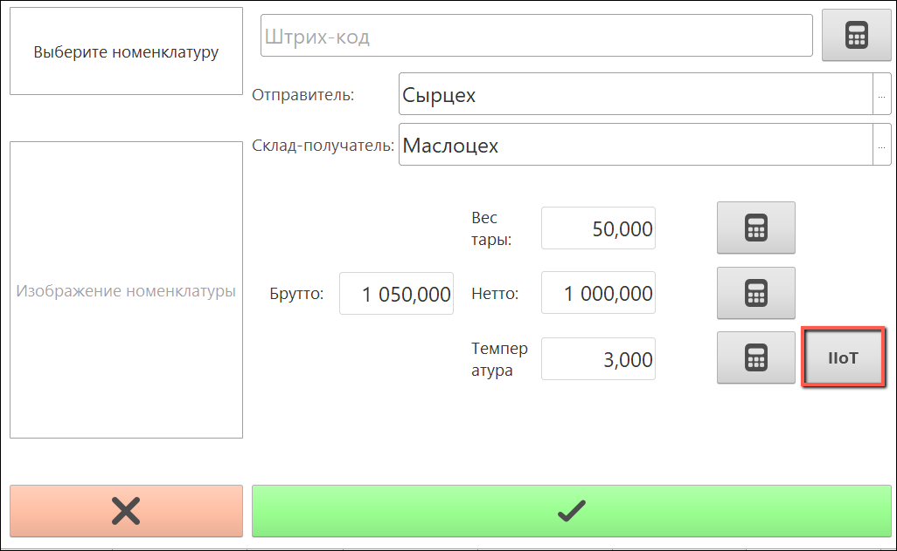
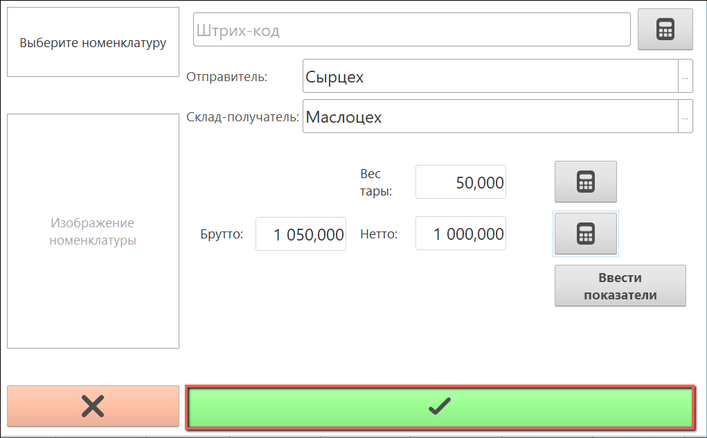

# Получение значений с датчиков в Приемке и передаче

Если для кнопки учетной точки выполнена соответствующая [настройка](SystemSetting/SettingButtonsOfAccountPoint.md), то в "**Приемке и передаче**" становится возможным получить значения с датчиков производства.

- Для этого нужно зайти в "**Приемку и передачу**":

- Выбрать нужную строку задания:

- Если указано больше одного показателя анализов, то сначала нужно заполнить поля "**Вес тары**", "**Брутто**" и  поле "**Склад-получатель**" (поле "**Нетто**" рассчитывается автоматически). Затем нажать на кнопку "**Ввести показатели**":

- В открывшемся окне нажать на кнопку "**IIoT**" и "**Подтвердить**":

- Если показатель один, то нужно заполнить поля и нажать на кнопку "**IIot**" рядом с полем значения показателя:

- Подтвердить приемку: 

