# Начальное заполнение данных для записи в регистр "Данные к обработке"

## Оборудование

- Открыть справочник "**Виды оборудования**":

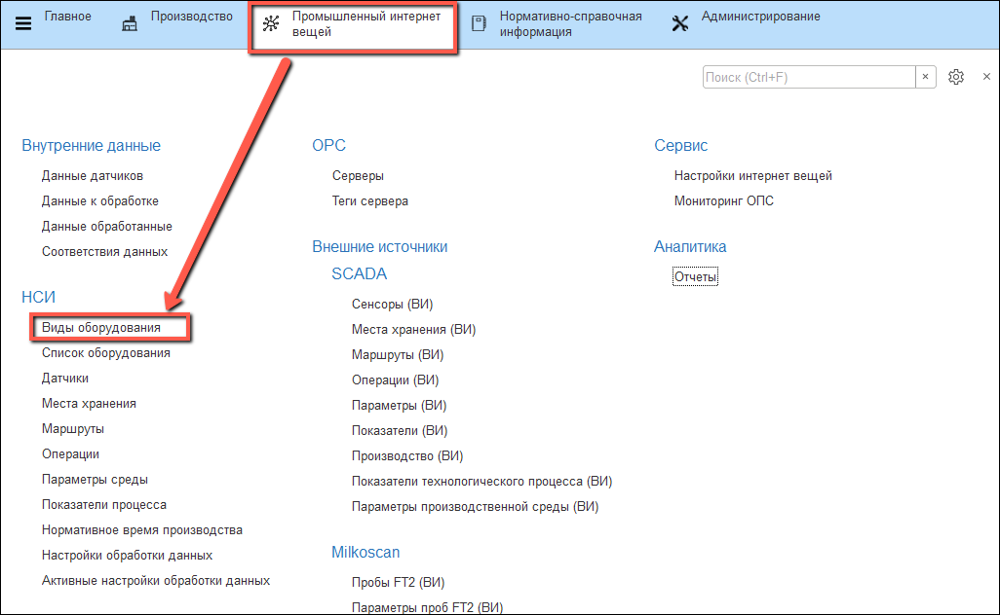

- В форме элемента необходимо указать "**Наименование**":

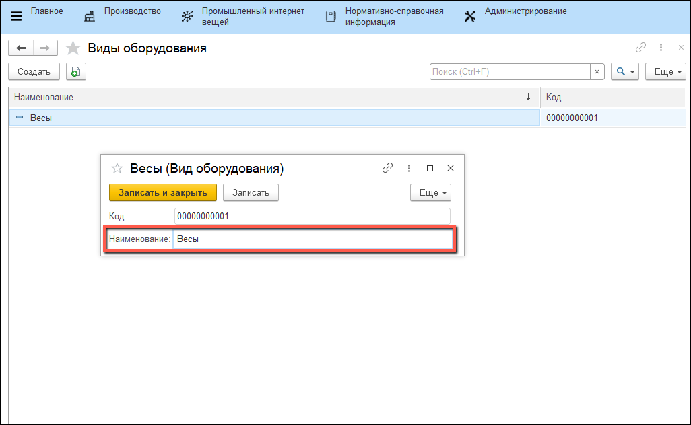

- Открыть справочник "**Список оборудования**":

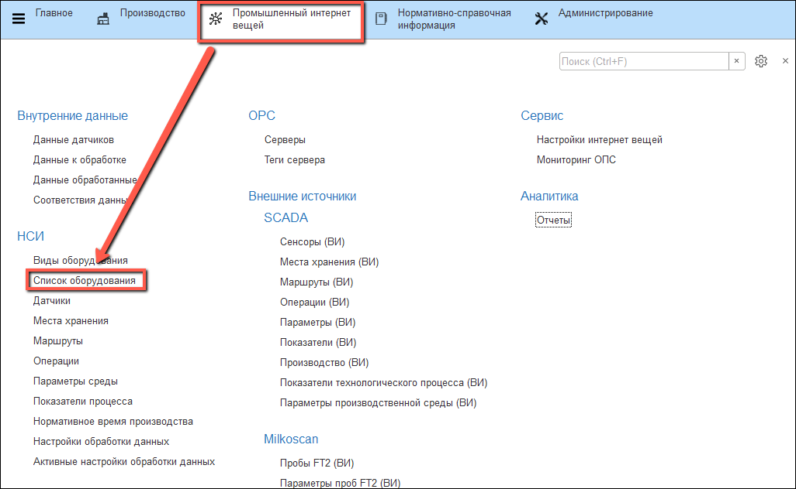

- В форме элемента указать: "**Наименование**", "**Вид оборудования**", "**Инвентарный номер**" и "**Рабочий центр**":

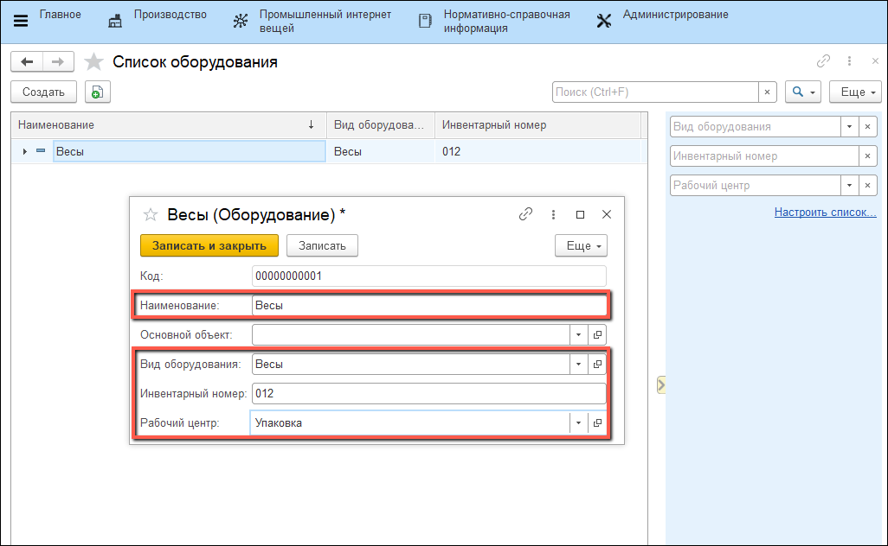

## Настройки обработки данных

- Открыть справочник "**Настройки обработки данных**":

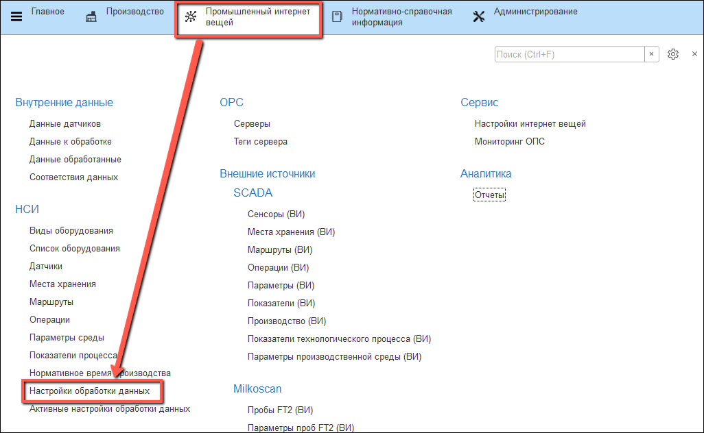

- В форме элемента на вкладке "**Основное**" заполнить: "**Рабочий центр**", "**Оборудование**", "**Тип данных**":

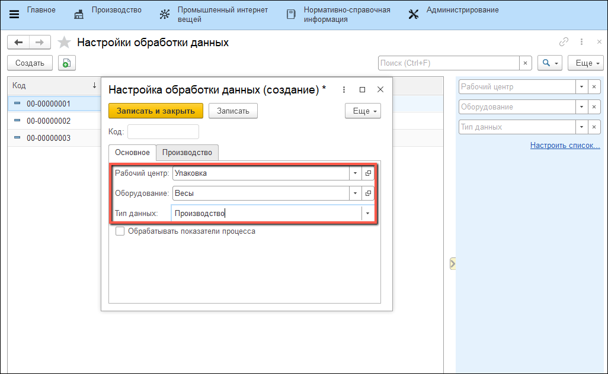

- Если необходимо также получать данные показателей технологического процесса, то нужно установить флаг "**Обрабатывать показатели процесса**":

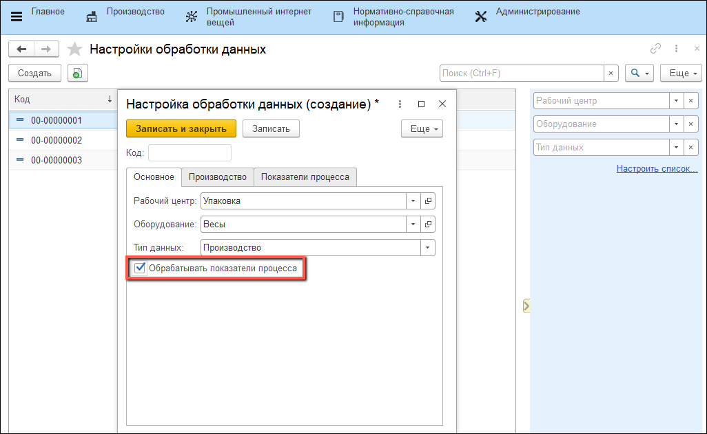

??? Info "Настройку датчика см. в разделе "**Настройки датчика для записи в регистр "Данные к обработке"**" в [настройках датчиков](../SystemSetting/Sensors.md)"

- На вкладке "**Производство**" заполнить поле "**Количество**" и поля "**Варианты списания**":

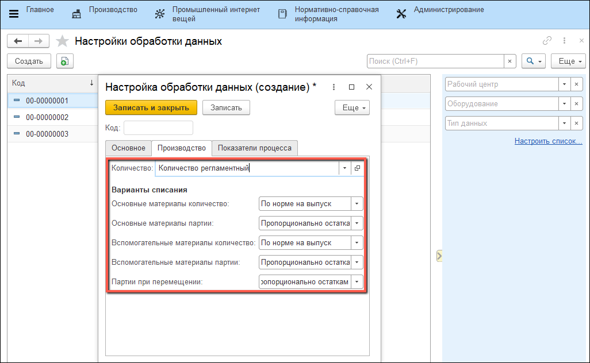

- Если необходимо также получать данные показателей т/п, то на вкладке "**Показатели процесса**" нужно заполнить поле "**Вид показателей анализа**" и добавить "**Датчики**":

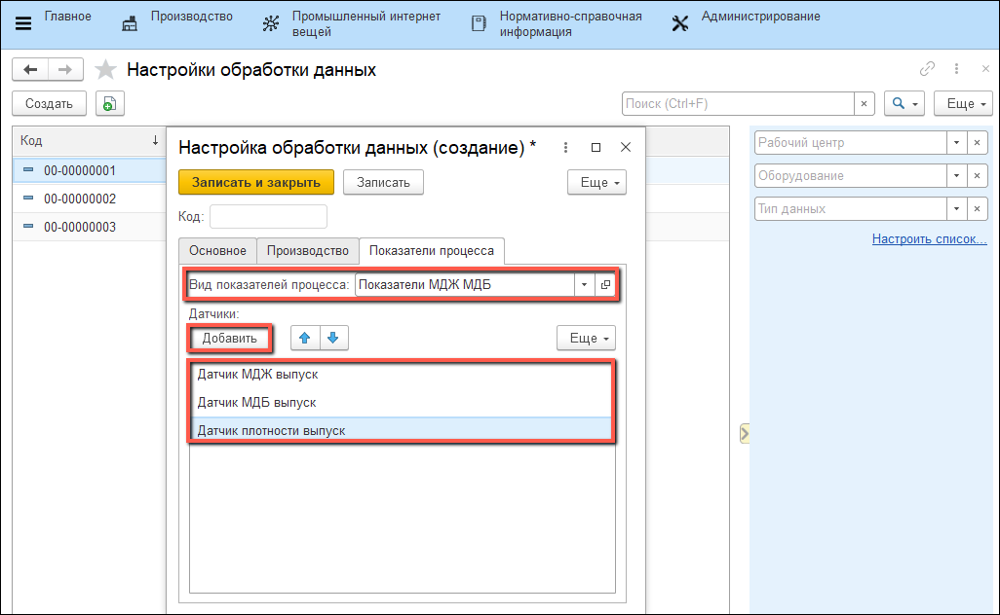

- Открыть справочник "**Активные настройки обработки данных**":

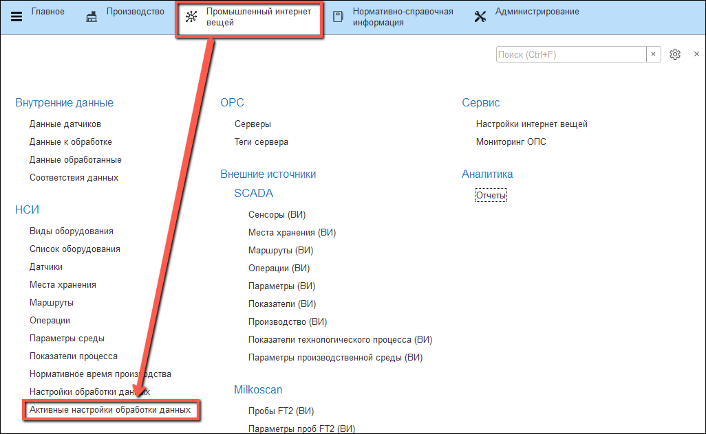

- В форме элемента заполнить "**Датчик**" и "**Настройка обработки данных**":

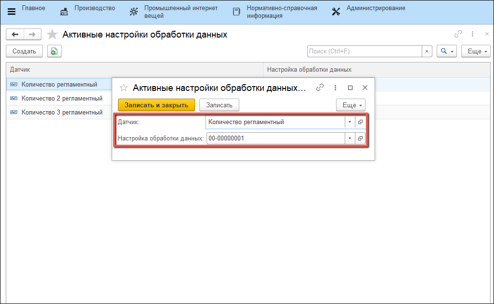

## Настройка регламентного задания для получения данных с датчиков

- Открыть "**Обслуживание**":

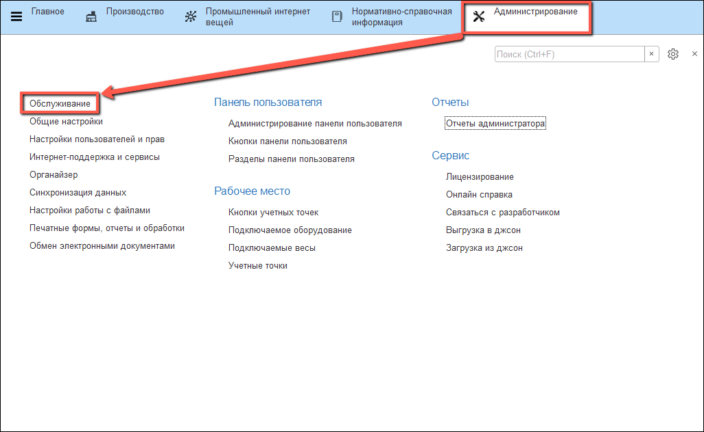

- Перейти по гиперссылке "**Регламентные и фоновые задания**":
  
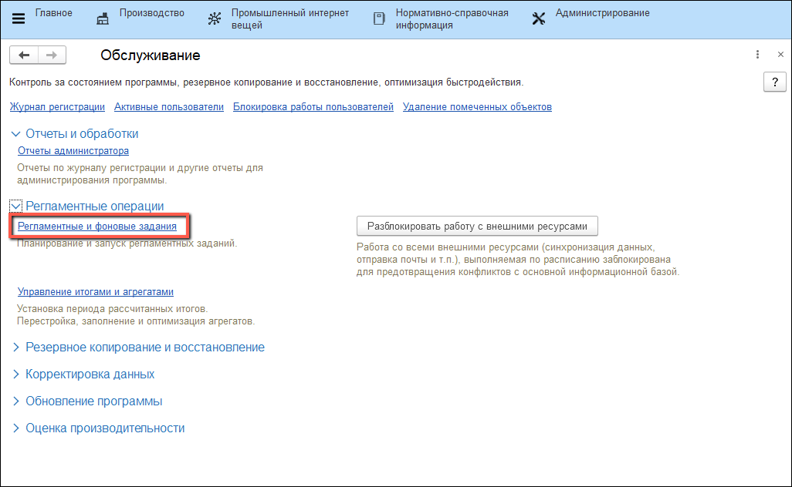

- Найти регламентное задание "**Интернет вещей: Получение данных к обработке**":
  
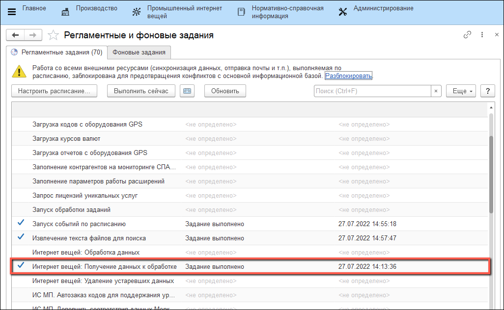

- Включить выполнение регламентного задания:

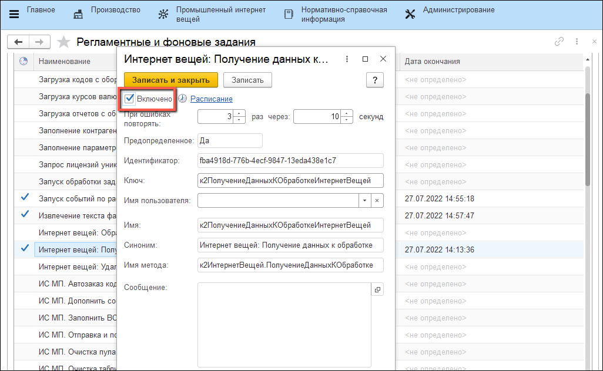

- Настроить "**Расписание**":

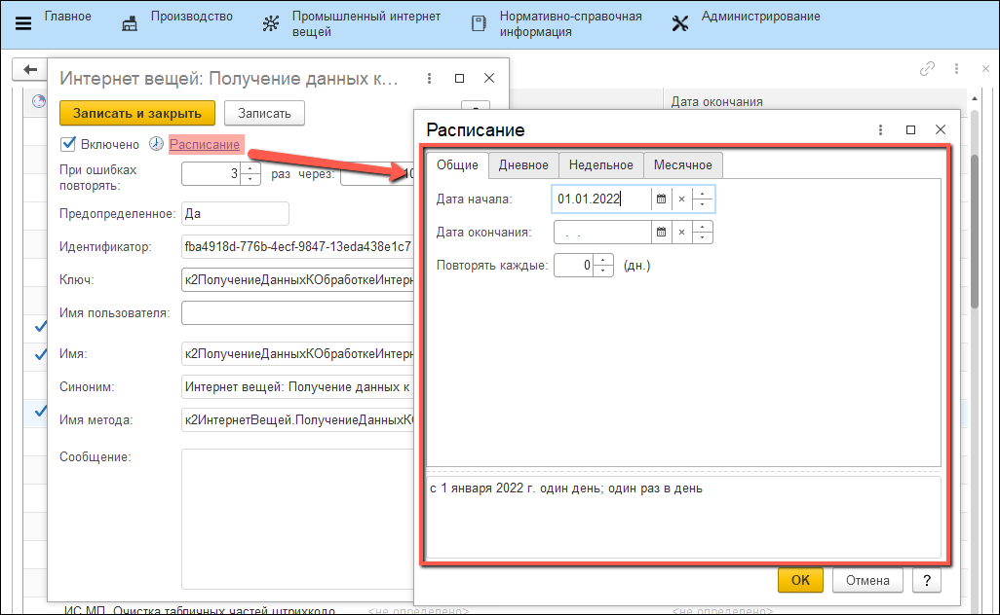
