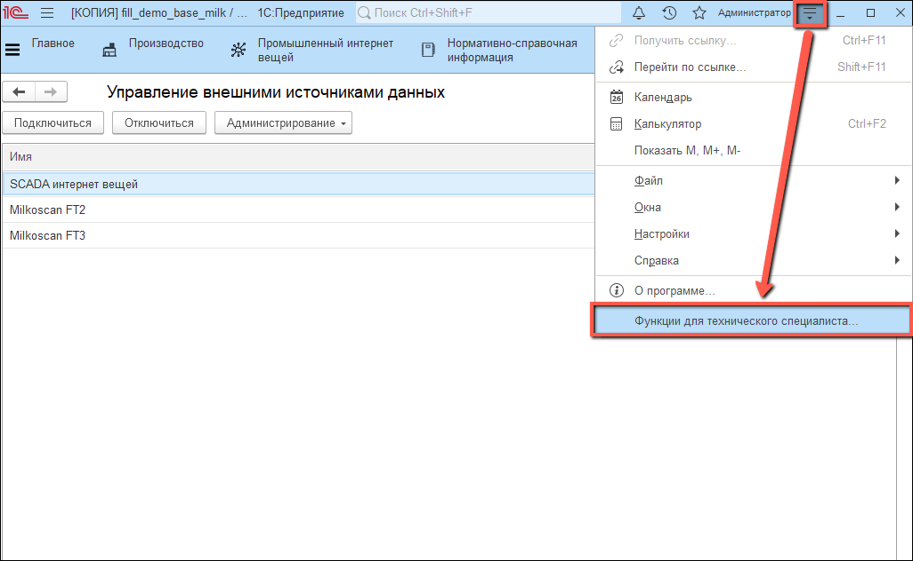
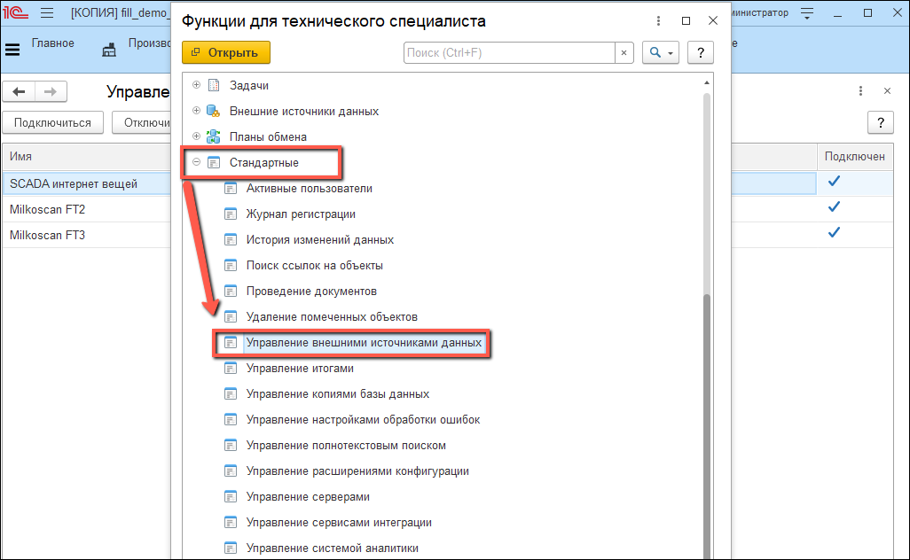
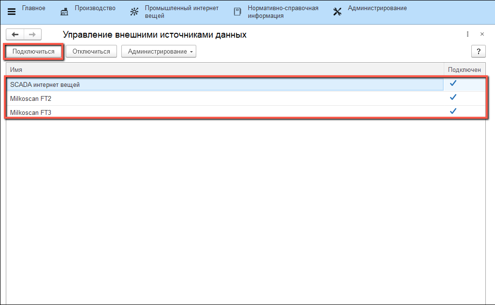
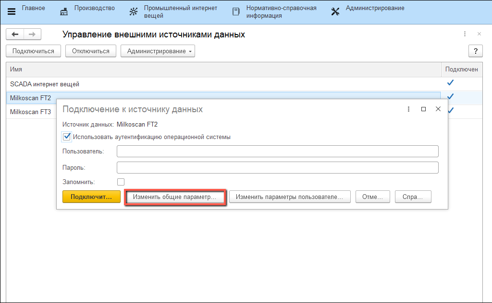
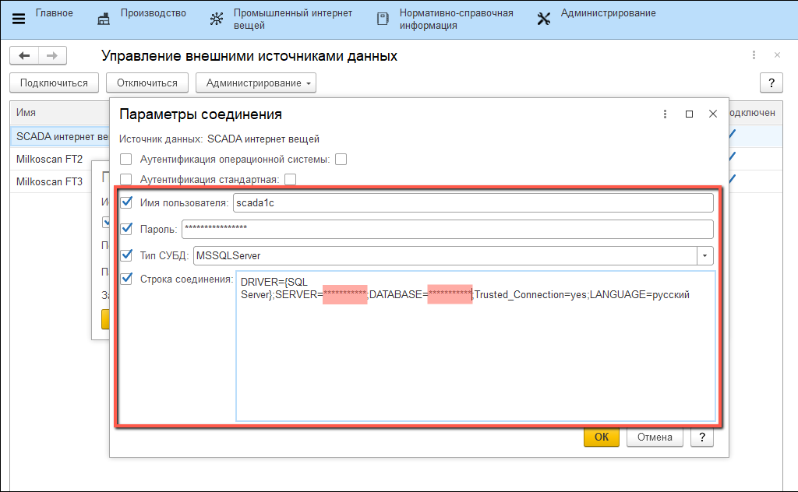
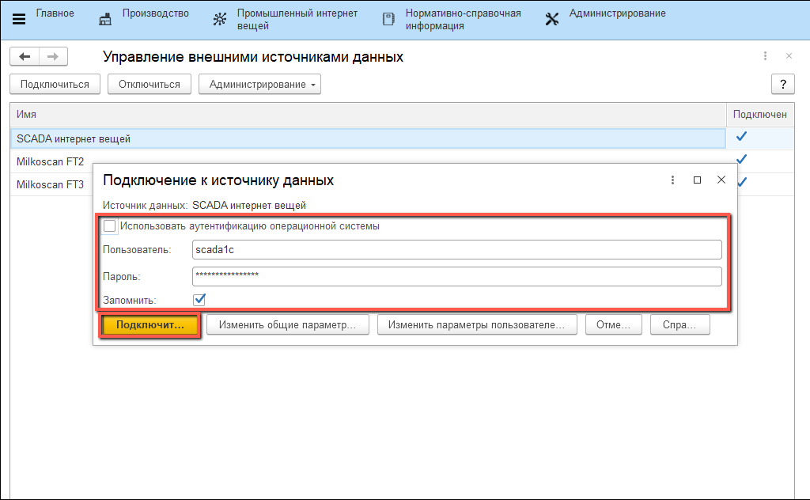

# Подключение к внешним источникам

Для начала получения информации с датчиков SCADA/Milkoscan необходимо настроить в системе подключение к внешним источникам.

- Открыть "**Функции технического специалиста**":

- Открыть "**Управление внешними источниками данных**" из раздела "**Стандартные**":
  

- Выбрать строку, нажать "**Подключиться**":

- В открывшемся окне нажать "**Изменить общие параметры**":

- В окне параметров заполнить поля "**Имя пользователя**", "**Пароль**", "**Тип СУБД**" и "**Строка соединения**":

*В строке соединения заменить звездочки на адрес сервера и имя базы данных*

- Подтвердить изменения и заполнить поля подключения. Нажать "**Подключить**":

