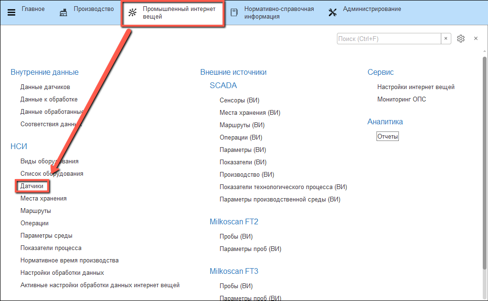
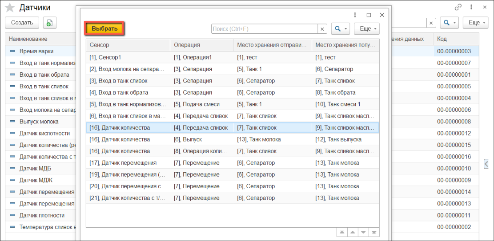

# Датчики

Каждый физический датчик (на количество выпущенных сливок, на количество молока, принятого в каждый танк и т.п.) в системе должен соответствовать одному элементу справочника "Датчики". Элемент содержит информацию о том, как обрабатывать данные, получаемые с датчика.

## Вкладка Общее

- Открыть справочник "**Датчики**":

- Перейти к созданию нового элемента. Указать "**Наименование**":

- Указать "**Вариант использования**":

    - Регламентное задание - не требует участия человека, система сама получает и обрабатывает данные с датчика;
    - По запросу - обращение к датчику происходит по запросу сотрудника - по нажатию настроенной кнопки.

- Выбрать "**Тип данных**":
    - Производство - показатели количества;
    - Показатели технологического процесса. Например, показатели "**МДЖ**" и "**МДБ**";
    - Параметры производственной среды - показатели склада (например, влажность);
 

- Выбрать "**Тип значения данных**" и "**Источник данных**":
 

- Для типа данных "**Производство**" также нужно указать "**Вид пересчета**":
 

- Если используется пересчет, указать "**Способ пересчета**" и "**Показатель плотности**":
 

- Для источников данных "**SCADA**", "**Milkoscan FT2**" или "**Milkoscan FT3**" так же нужно указать "**Способ получения значения**":
 

## Вкладка Учетные данные

На вкладке "Учетные данные" заполняются индивидуальные параметры для каждого типа данных.

- Для **"Показателей технологического процесса"** необходимо заполнить показатель анализов:

- Для **"Производства"** необходимо заполнить склады:

- Для **"Параметров производственной среды"** необходимо заполнить склад и показатель склада:

## Вкладка Подключение

### OPC

- Указать "**Тег значение**":

- Опционально можно указать "**Тег дата готовности значения**":

### SCADA

- Нажать **"Подобрать"**. Выбрать строку, соответствующую нужному датчику (сенсор, операции, места хранения).

- Нажать на кнопку **"Выбрать"**

- Значения идентификаторов заполнятся автоматически:

### Milkoscan FT2/FT3

??? Info "Чтобы указать Milkoscan как "**Источник данных**" на вкладке Общее, необходимо в качестве "**Типа данных**" выбрать "**Показатели технологического процесса**""

- Выбрать "**Показатель анализов**":

## Запись и проверка подключения

- Когда все поля заполнены, нужно нажать кнопку "**Записать**". После записи появляется возможность проверить датчик, нажав на кнопку "**Проверить подключение**":

## Настройки датчика для записи в регистр "Данные к обработке"

- Для передачи данных в регистр "**Данные к обработке**" и дальнейшего использования в обработке "**Рабочее место мастера смены**" нужно:
    -  Заполнить поле "**Оборудование**"
    -  Указать "**Вариант использования**" - "Регламентное задание"
    -  Указать "**Тип данных**" - "Производство" или "Параметры производственной среды"
    -  Указать "**Тип значения данных**" - "Число"

