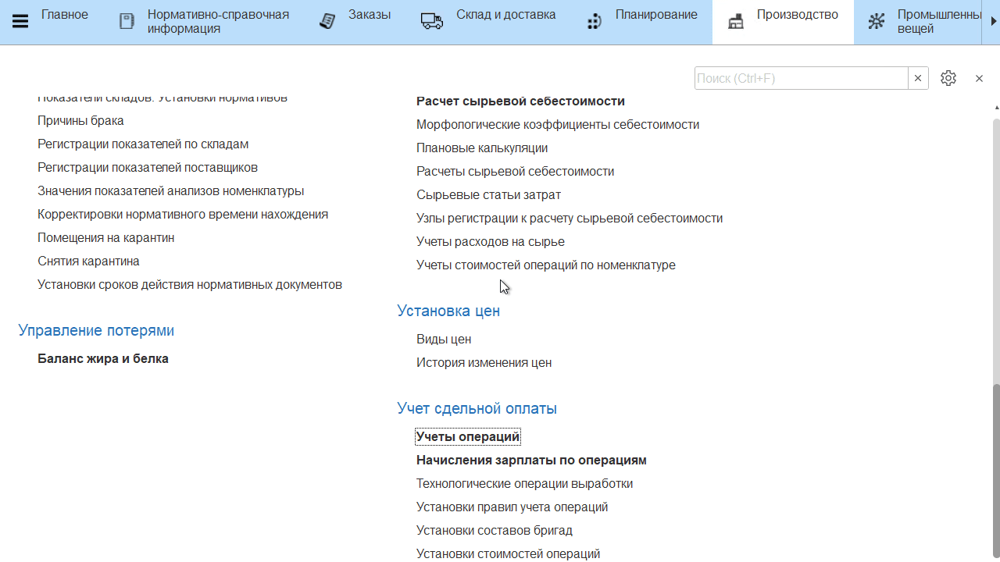

# Оперативный учет выработки сотрудников

Помимо учета, который и так происходит через действия, настроенные в
**"Меню учетных точек"**, нужно вручную учитывать еще какие-либо операции,
совершенные сотрудниками за определенную смену.

-   Открыть документы **"Учет операций"** и перейти к созданию нового;     
-   Указать, что документ создается вручную;
-   Указать дату смены и смену, по которой нужно учесть выработку
    сотрудников; 
-   Указать участок, на котором были выполнены операции;
-   На вкладке *"Операции"* указываются бригадные операции, на вкладке
    *"Операции индивидуальные"* - индивидуальные. Если нужно учесть
    бригадные, то перейти на вкладку *"Операции"*, добавить операцию;  
-   Указать, какое её количество было выполнено;
-   Повторить для остальных дополнительных бригадных операций.

-   Если нужно учесть индивидуальные, то перейти на вкладку *"Операции индивидуальные"*, добавить операцию;
-   Указать, кто её выполнил; 
-   Указать, в каком количестве была выполнена операция; 
-   Повторить для остальных дополнительных индивидуальных операций;
-   Перейти на вкладку *"Выработка по сотрудникам"*. Нажать **"Заполнить"**.  
    Автоматически произведется расчет по указанным выше операциям.  
    Бригадные распределятся поровну на сотрудников бригады, назначенной
    на участок, а индвидуальные уйдут только их исполнителям;
-   Бригадные можно скорректировать, если кто-то из участников бригады
    работал больше, кто-то меньше. Но сумма в итоге не может отличаться
    от количества, указанного на вкладке *"Операции"*;
-   Нажать **"Провести и закрыть"**.

