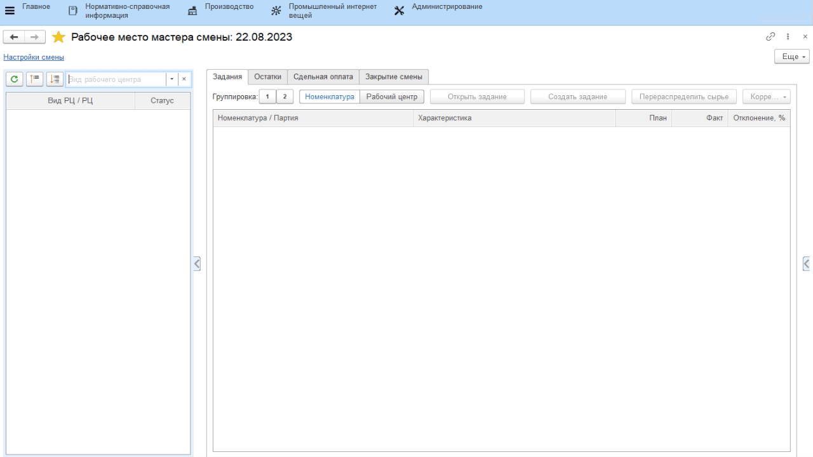

# Закрытие смены

В конце каждой смены необходимо начислить сотрудникам зарплату по
выработке, которую они сделали по участкам. Функционал для этого
находится в **"Рабочем месте мастера смены"**.

Первым этапом необходимо свести всю выработку в едином месте, вторым -
по распределенной выработке с учетом стоимости операций начислить
итоговую зарплату.

-   Открыть **"Рабочее место мастера смены"**;
-   Указать дату смены и смену;
-   Выбрать участок, по которому нужно начислить зарплату;
-   Перейти на вкладку *"Сдельная оплата"* -\> *"Учет операций"*;
-   Нажать **"Заполнить"**, если учет происходит первый раз за смену, или
    **"Перечитать"**, если нужно внести коррективы в уже учтенных данных;
-   Заполнится информация по выработке. Здесь можно скорректировать,
    управляя коэффициентами, объемами выработки сотрудников (корректно
    распределить между бригадными участниками - управляя КУТ,
    скорректировать индивидуальные объемы);
-   После проверки всех данных нажать **"Учесть"** и перейти на вкладку
    *"Начисление зарплаты"*;
-   Нажать **"Рассчитать"**. По данным предыдущей вкладки и данным по
    стоимостям операций рассчитается зарплата каждого из сотрудников;
    
    >> Стоимость = Количество выработки операции \* Стоимость операции  

-   Премиальным коэффициентом можно урезать или увеличить итоговую выработку в зависимости от сложившейся ситуации.   
-   После проверки нажать **"Начислить"**. Выработка за смену учтена.

