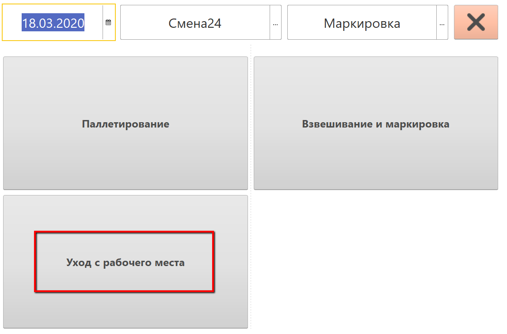
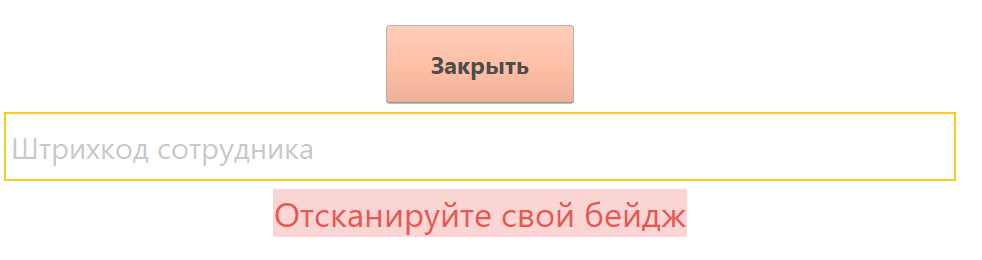
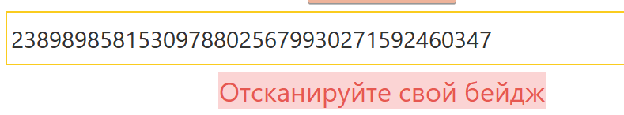
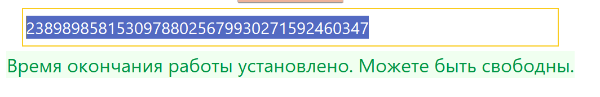

# Уход с рабочего места раньше положенного

Бывают ситуации, когда сотрудникам требуется "аварийно" покинуть свое
рабочее место - дела или иные важные обстоятельства. Учесть свой уход в
системе сотрудник может не отходя от своего рабочего места.

-   Там же, где находятся все кнопки совершаемых действий через "Меню
    учетных точек", есть отдельно настроенная точка для фиксации такой
    операции:      

-   Нажать на нее. Откроется окно сканирования бейджа сотрудника:  

-   Просканировать свой бейдж (или, если не подключен сканер, вбить
    индивидуальный номер):  

-   Готово, можете покинуть рабочее место:  

