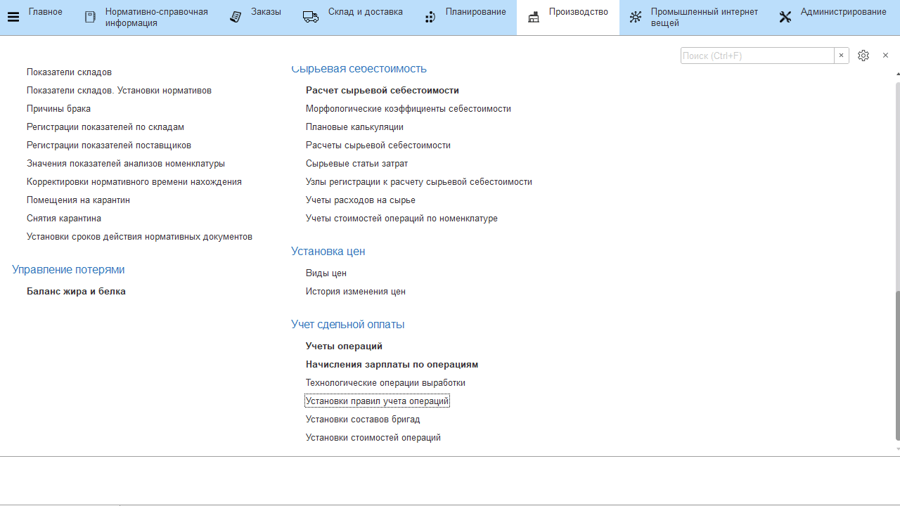

# Установка стоимости операций выработки

У любой операции выработки должна быть установлена стоимость, чтобы
считать будущую зарплату сотрудников.

-   Открыть документы **"Установка стоимости операций"** и перейти к созданию нового;
-   Перейти на вкладку **"Операции"** и добавить новую;
-   Указать операцию и её стоимость;
-   Повторить действия для остальных операций и нажать **"Провести и закрыть"**. 
 
Важно помнить, что действие стоимости операции начинается от даты документа.

