# Установка составов бригад

Для распределения бригадной выработки по определенным операциям
необходимо в системе фиксировать состав бригады на участок, иногда даже
на смену.

Это можно сделать двумя способами: если учет по времени не нужен - то
созданием документа, если нужен - документом или из рабочего места
мастера смены.

 

<h3> Документ "Установка составов бригад" </h3>

-   Открыть документы "Установка составов бригад" и перейти к созданию
    нового:  
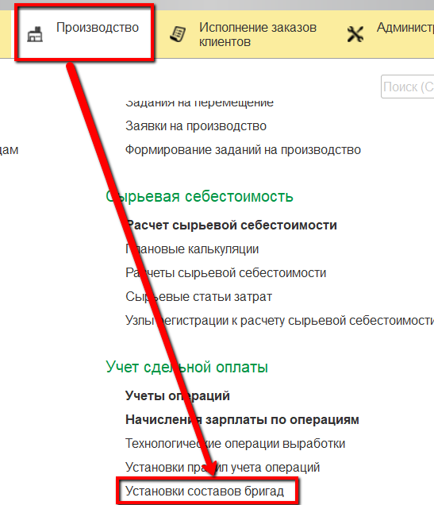
-   Указать, будет ли учитываться время и смена  для этой бригады:  
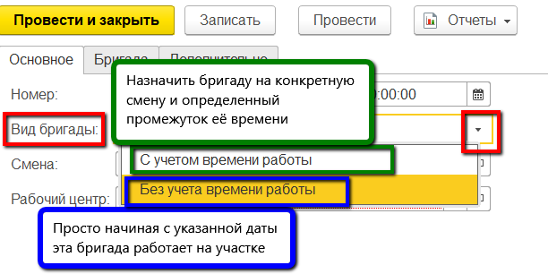
-   Указать смены, в которые будет работать бригада (например, если
    указать смену с 8-16, то это означает, что каждый день указанная
    бригада работает с 8 до 16):  
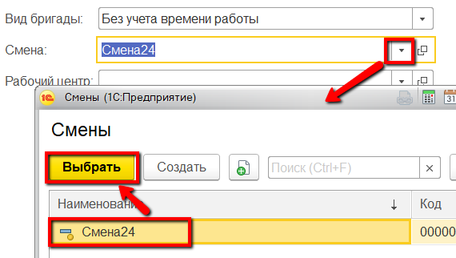
-   Указать участок, на котором будет работать эта бригада:  
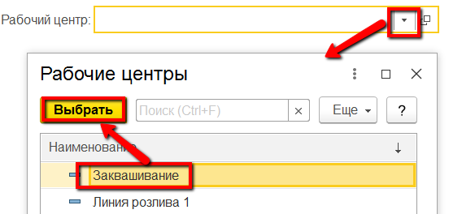
-   Перейти на вкладку "Бригада". Здесь нужно будет перечислить
    сотрудников, входящих в указанную бригаду. Нажать "Добавить":  
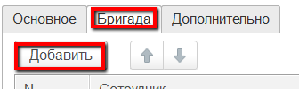
-   Выбрать первого сотрудника:  
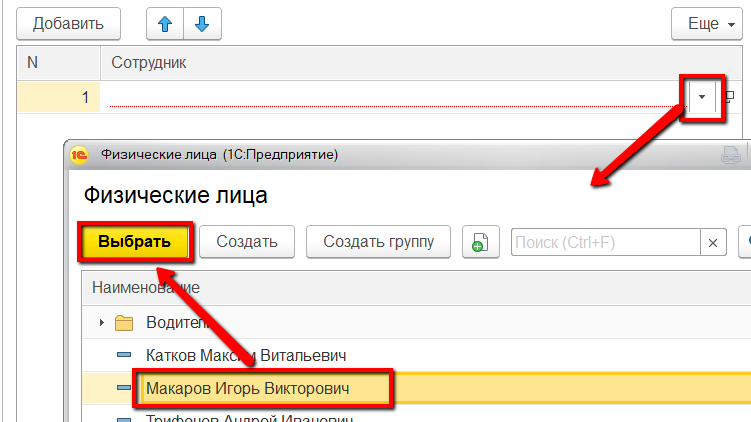
-   Если был включен учет времени в п.2, то указать время начала и время
    окончания работы сотрудника в указанную смену:  
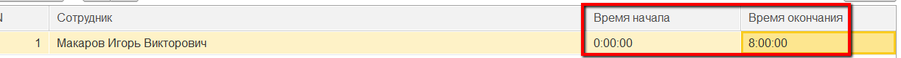
-   Добавить остальных сотрудников, входящих в состав бригады и нажать
    "Провести и закрыть".

<h3> Рабочее место мастера смены" </h3>

-   Открыть "Рабочее место мастера смены":  

-   Указать нужную дату и смену:  

-   Указать участок, на который нужно установить состав бригады:  
  
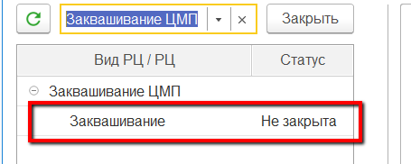
-   Перейти на вкладку "Сдельная оплата". Нажать "Назначить бригаду на
    смену":  
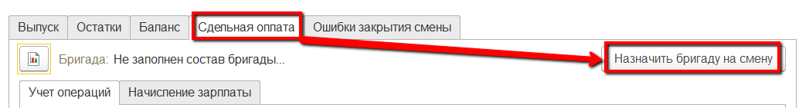
-   В открывшейся форме указать, кто из сотрудников назначен в бригаду:  
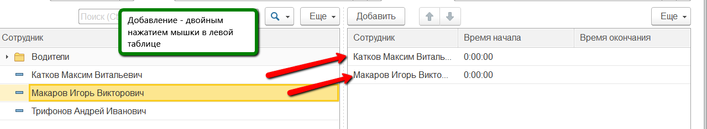
-   Для каждого указать часы работы:  
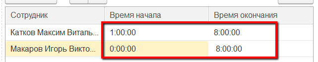
-   Сохранить:  
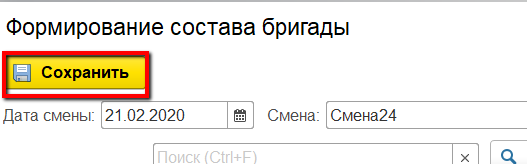