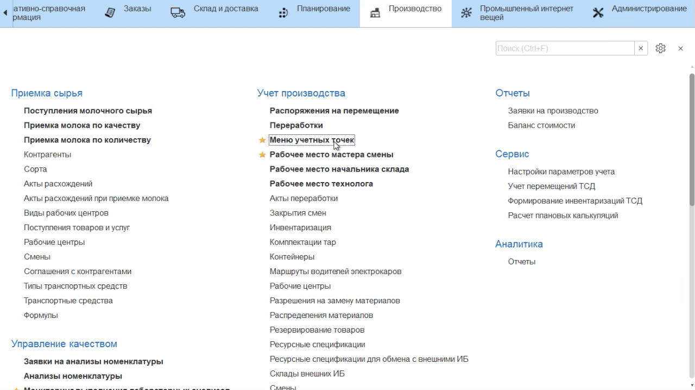

# Выпуск через киоск

Выпуск сливок в системе происходит через учетную точку, привязанную к
участку, где сепарируется молоко.

-   Открыть **"Меню учетных точек"**;
-   Указать текущую дату и смену, если они еще не указаны;
-   Указать учетную точку, которая соответствует участку сепарации
    молока;
-   Нажать кнопку, соответствующую выпуску сливок. В открывшейся форме
    указать склад сепарации;
-   Отобразятся все остатки молока на выбранном складе. Выбрать партию
    молока, с которой были получены сливки и нажать **"Выбрать"**;
-   Указать, что учитывается выпуск сливок; 
-   Указать, сколько сливок получилось;
-   Подтвердить, нажав кнопку с галочкой.

