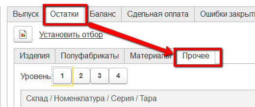
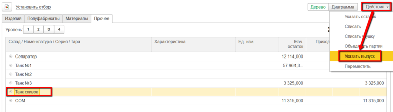
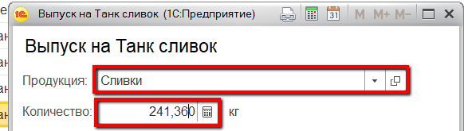
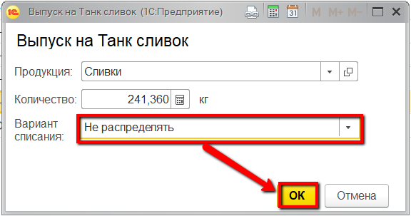

# Выпуск мастером смены

Выпуск сливок в системе также может отразить и мастер смены через свое
рабочее место.

-   Открыть "Рабочее место мастера смены":  

-   Указать дату смены, смену и участок приемно-аппаратного цеха:  
  
 
-   Выбрать участок сепарации:  
 
-   Перейти на вкладку "Остатки" -\> "Прочее":  

-   Выбрать танк сливок, куда они выпустились. Нажать "Указать выпуск":  

-   Указать, что это был выпуск сливок и их количество:  

-   В варианте списания указать "Не распределять", чтобы в конце смены
    можно было списать молоко по внесенным позже показателям жира и
    белка, и подтвердить:  

 
