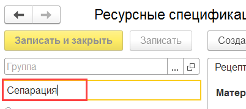
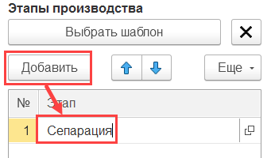
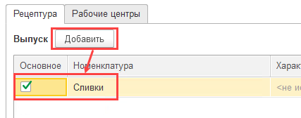
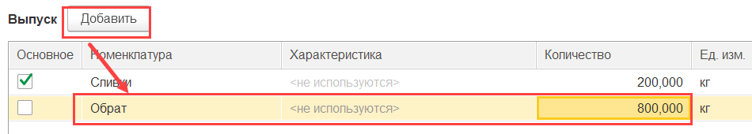
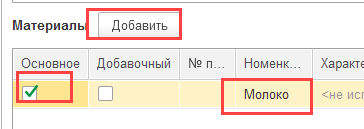
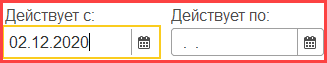
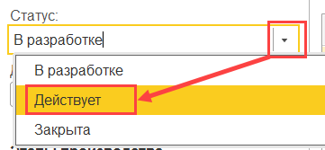

**Рецептуры**
=============

Рецептуры по нормативному расходу сырья на этапе сепарации молока
задаются в справочнике "Ресурсные спецификации". При этом на обрат и сливки можно задать как разные рецептуры, так и указать их выхода в рамках одной рецептуры.

 

-   Открыть справочник и перейти к созданию нового элемента, выбрав
    создание через форму "Работа со спецификацией" (выбор может быть отключен, сразу откроется форма создания рецептуры):  
  

    
-   Указать наименование - продукция, на которую задается рецептура, или
    общее название для рецептуры:  

-   Добавить новый этап в таблице этапов, указав его наименование:
    
    

-   Перейти на вкладку "Рабочие центры". Указать вид рабочего центра для этапа рецептуры:
    
      
    
-   В таблице рабочих центров перечислить все участки, относящиеся к указанному этапу
    производства, т.е. те, на которых этот этап может протекать:  

    
-   Перейти на вкладку "Рецептура". В таблицу "Выпуск" добавить продукцию, на которую задается рецептура, отметив ее основной. Указать выходное количество - по рецептуре: 
    

-   Помимо продукции указать в таблице второстепенные выпуски, если
    таковые есть (например, обрат), указать их количество:  
    

    
-   В таблице "Материалы и работы" указать все материалы, следуя рецептуре, их количество и возможный процент отклонения от этого количества в обе стороны. Отметить основной материал - галочкой "Основное":  
    

- Установить дату начала действия рецептуры, опционально - окончания:  
  

-   Установить статус "Действует":  
    

- Нажать "Записать и закрыть".

