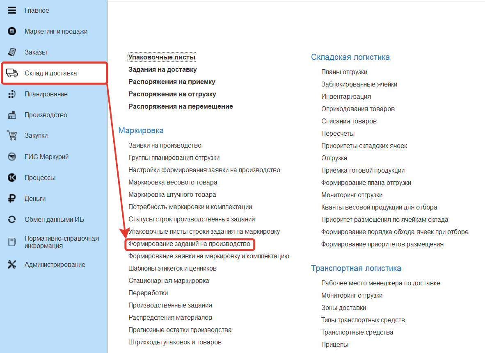
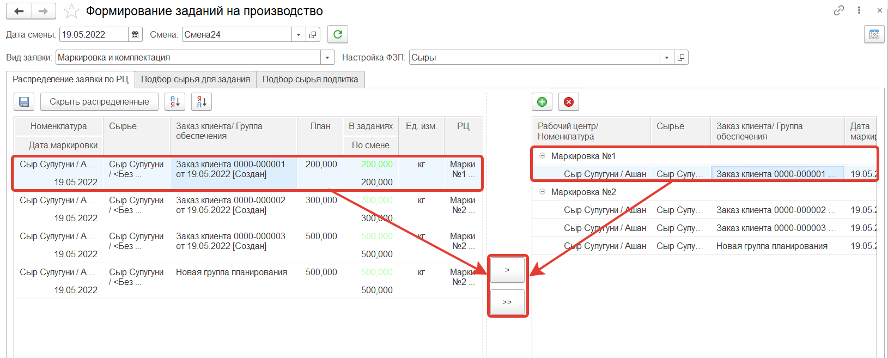
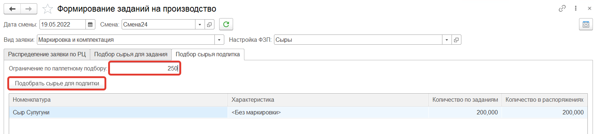
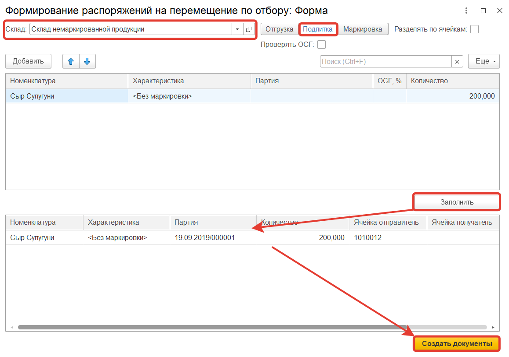
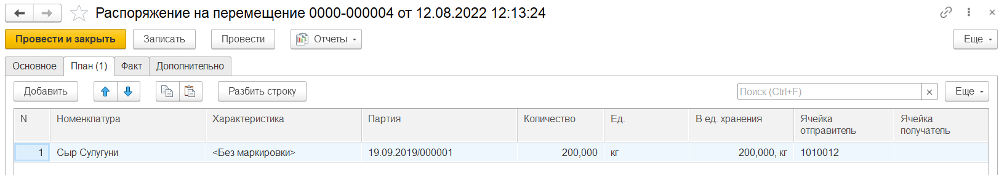
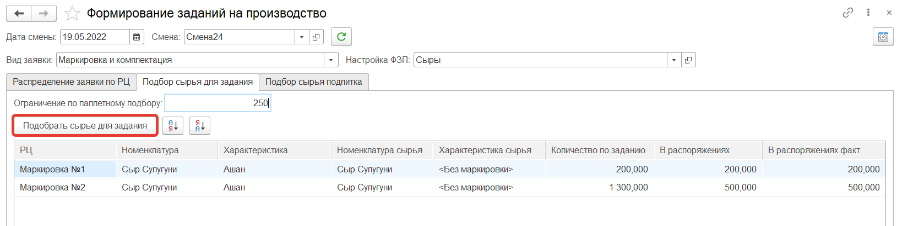
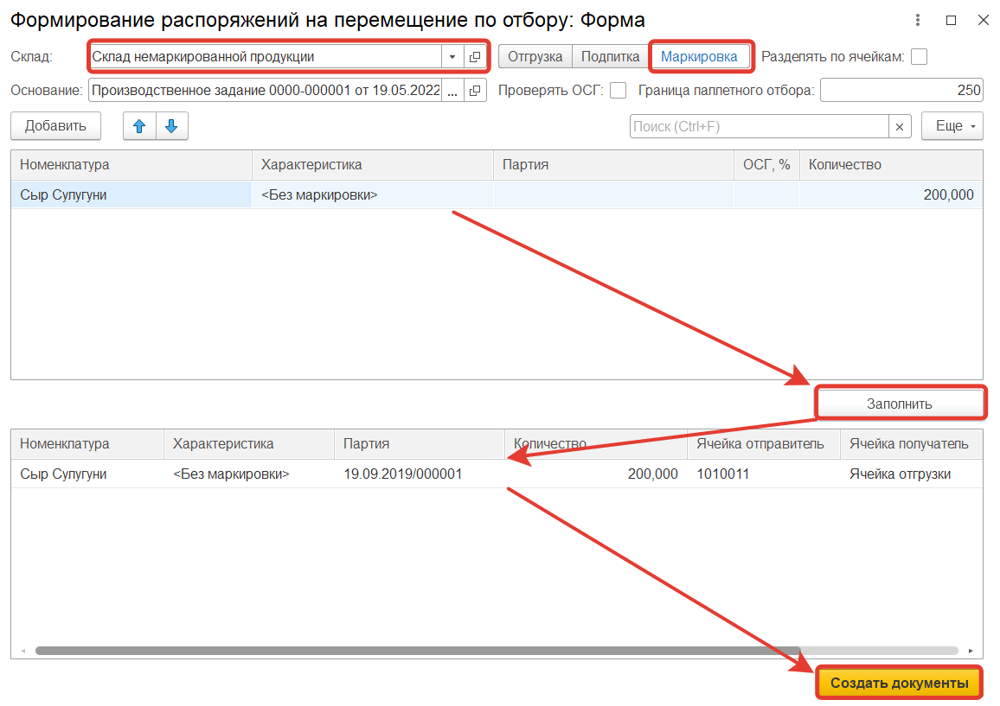
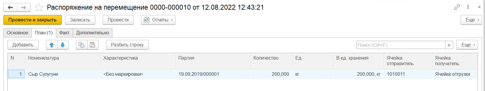

# Фомирование задания на производство (маркировку)

Обработка **"Формирование заданий на производство"** используется для установления каким рабочим центром номенклатура будет маркироваться и создания в результате документа **"Производственное задание"**. Обработка расположена в разделе **"Склад и доставка"** в подсистеме **"Маркировка"**.

В верхней части формы обработки заполняем поля:

- Дата смены
- Смена
- Вид заявки
- Настройки ФЗП

На вкладке **"Распределение заявки по РЦ"** в левой части формы будут выведены строки  **"Заявки на маркировку и комплектацию"**. Для распределения заявки по рабочим центрам необходимо в правой части формы обработки добавить рабочие центры, затем с помощью кнопок **>** или **>>** соотнести строки **"Заявки на маркировку и комплектацию"** с рабочим центром. Далее сохраняем распределение, в результате создается документ **"Производственное задание"**.

Далее для строк задания, в которых количество меньше чем ограничение по паллетному подбору, необходимо переместить сырье в ячейку подпитки. Для этого в начале на вкладке **"Подбор сырья для подпитки"** заполняем **"Ограничение по паллетному подбору"**. После выбираем строку номенклатуры и нажимаем на кнопку **"Подобрать сырье для задания"**.

Откроется форма обработки **"Формирование распоряжений на перемещение по отбору"**  с типом **"Подпитка"**, на ней заполняем склад, затем нажимаем на кнопку **"Заполнить"**, в нижней части заполнится информация о перемещаемой номенклатуре, ячейка отправитель и ячейка получатель. Далее нажимаем кнопку **"Создать документы"**

В результате сформируется **"Распоряжение на перемещение"**  с типом **"Перемещение"** в статусе **"К выполнению"**. Перемещение будет выполнено после того как будет заполнена вкладка **"Факт"** и распоряжение будет переведено в статус **"Выполнено"**.

На вкладке **"Подбор сырья для задания"** сырье перемещается в ячейку отгрузки. Выбираем строку в таблице номенклатуры и нажимаем на кнопку **"Подобрать сырье для задания"**.

Откроется форма обработки **"Формирование распоряжений на перемещение по отбору"** с типом **"Маркировка"**, на ней заполняем склад, затем нажимаем на кнопку **"Заполнить"**, в нижней части заполнится информация о перемещаемой номенклатуре, ячейка отправитель и ячейка получатель. Далее нажимаем кнопку **"Создать документы"**.

В результате сформируется **"Распоряжение на перемещение"**  с типом **"Отбор"** в статусе **"К выполнению"**. Перемещение будет выполнено после того как будет заполнена вкладка **"Факт"** и распоряжение будет переведено в статус **"Выполнено"**.

В результате работы АРМа будут сформированы документы **"Производственное задание"**. В них содержится информация о том какая продукция маркируется и из какого сырья (немаркированной продукции).

Для выполнения данной цепочки необходимо предварительно сформировать **"Заявку на маркировку и комплектацию"**.
