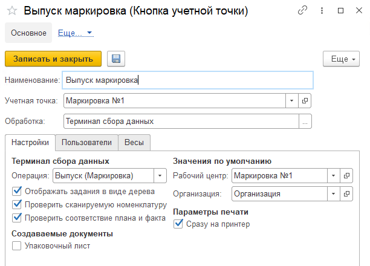

# Выпуск маркировка

Кнопка **"Выпуск маркировка"** используется для выпуска маркированной продукции.

При создании кнопки учетной точки **"Выпуск маркировка"** указываются:

- Наименование
- Учетная точка
- Обработка - Терминал сбора данных

На вкладке **"Настройки"** заполняются:

- Операция - Выпуск (Маркировка)
- Рабочий центр
- Организация

На вкладке **"Пользователи"** можно настраивать индивидуальные права доступа.
