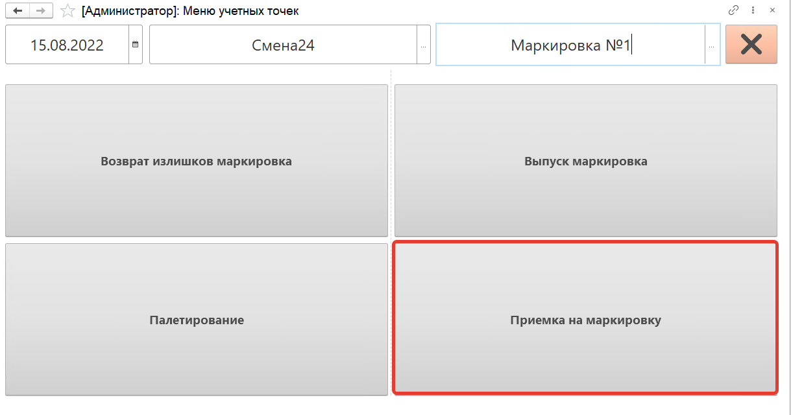
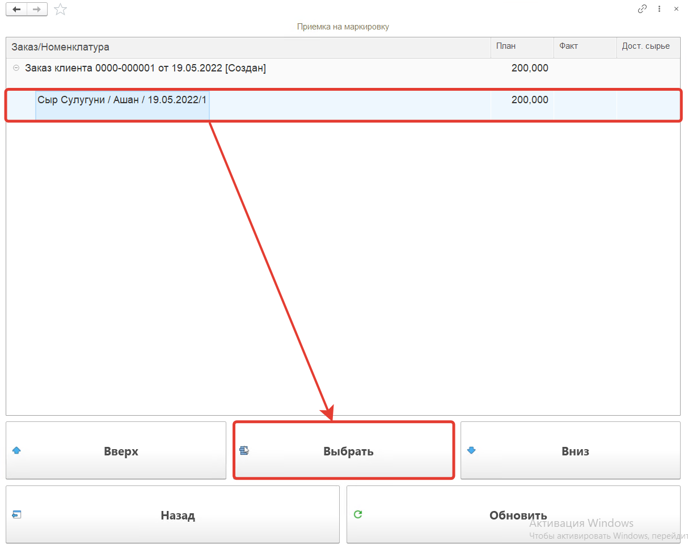
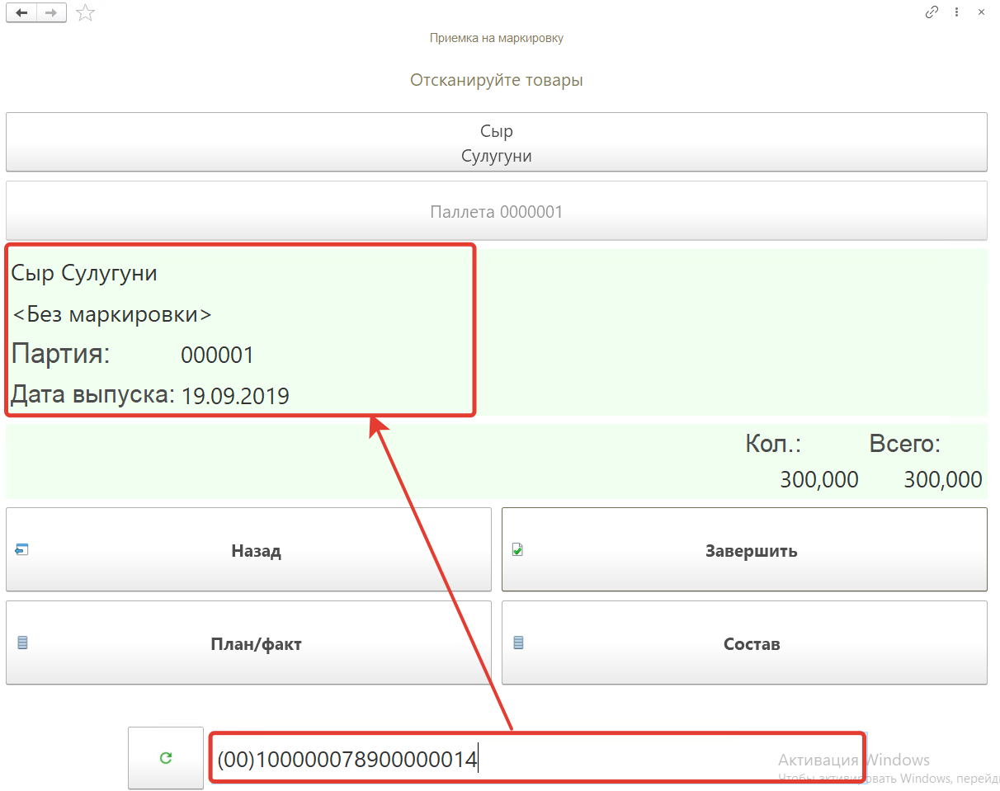
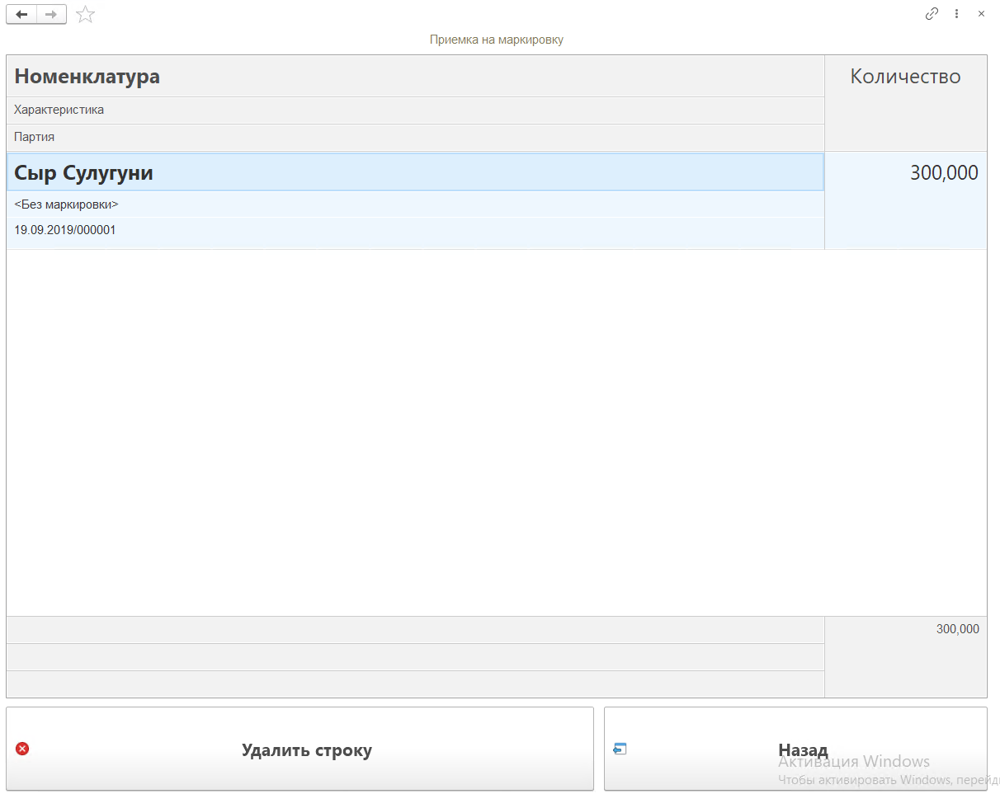
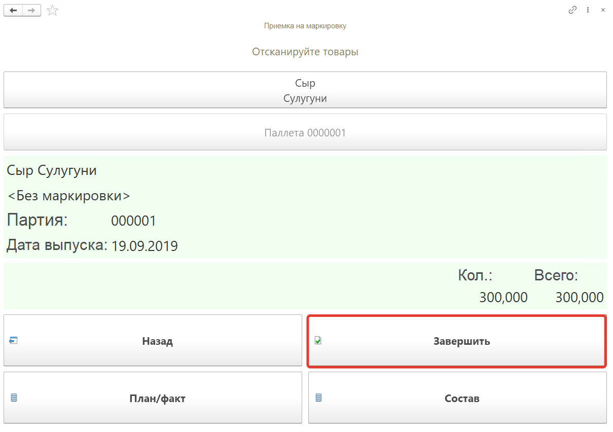

# Приемка на маркировку на ТСД

Кнопка **"Приемка на маркировку"** используется для приемки сырья на маркировку.

После открытия формы обработки "Меню учетных точек" заполняем поля:

- Дата
- Смена
- Учетная точка

На форме обработки появятся кнопки выбранной учетной точки, выбираем кнопку **"Приемка на маркировку"**.

На открывшейся форме появятся строки номенклатуры из **"Производственного задания"** для рабочего центра кнопки. Для каждой строки  будет отражен **план** и **факт** выпуска, а так же **доступное сырье**. В списке при помощи кнопок **"Вверх"** и **"Вниз"** переходим к строке, нажимаем на кнопку **"Выбрать"**.

Далее сканируем штрихкод короба сырья, номенклатура появится на форме.

Посмотреть состав отсканированной номенклатуры можно по кнопке **"Состав"**. На форме появится список номенклатуры, можно удалить строку с помощью кнопки **"Удалить строку"**.

Для завершения работы по приемке сырья нажимаем кнопку **"Завершить"**.

В результате будет сформирован документ **"Распределение материалов"**.

Предварительно необходимо сформировать "Упаковочный лист" и в табличной части "Товары" указать:

- Номенклатура "Сыр Сулугуни"
- Характеристика "<Без маркировки>"
- Количество "300,000"