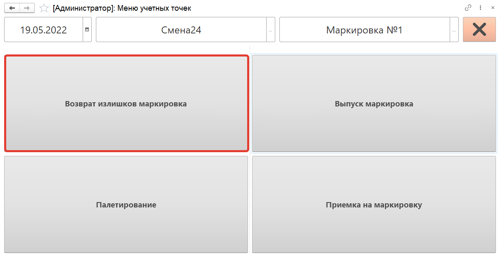
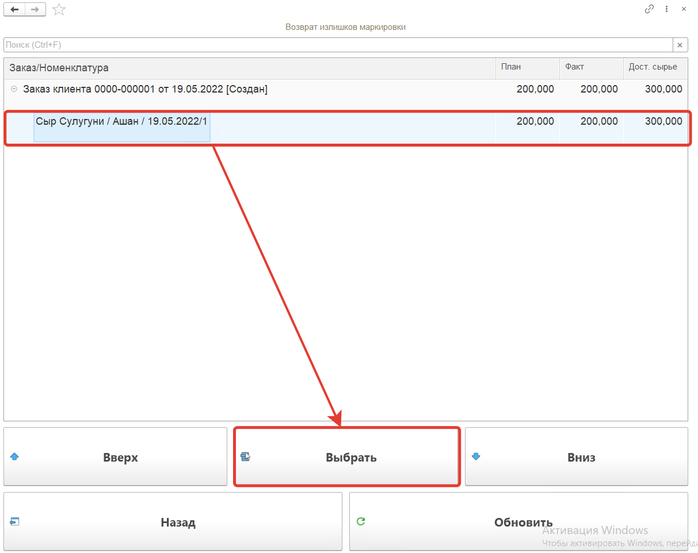
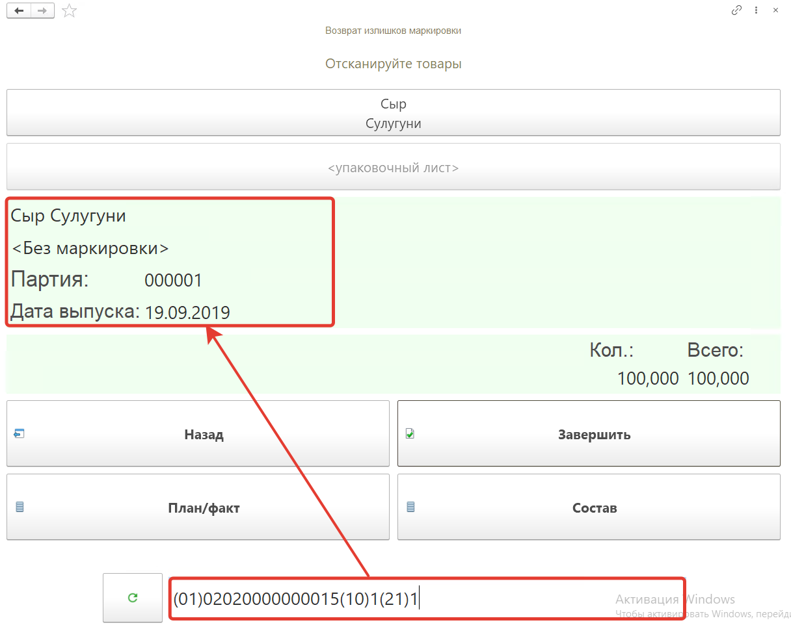
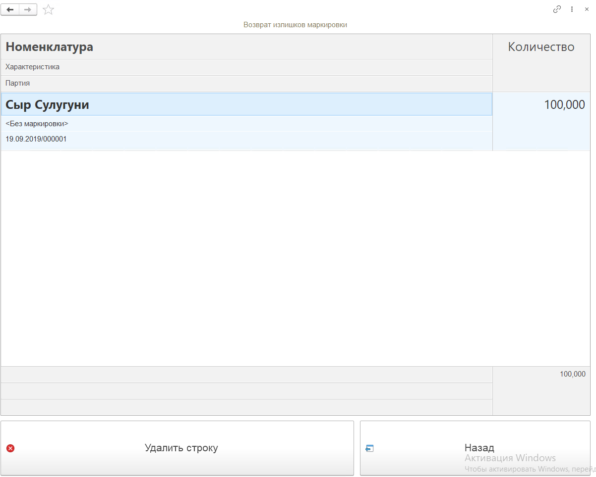
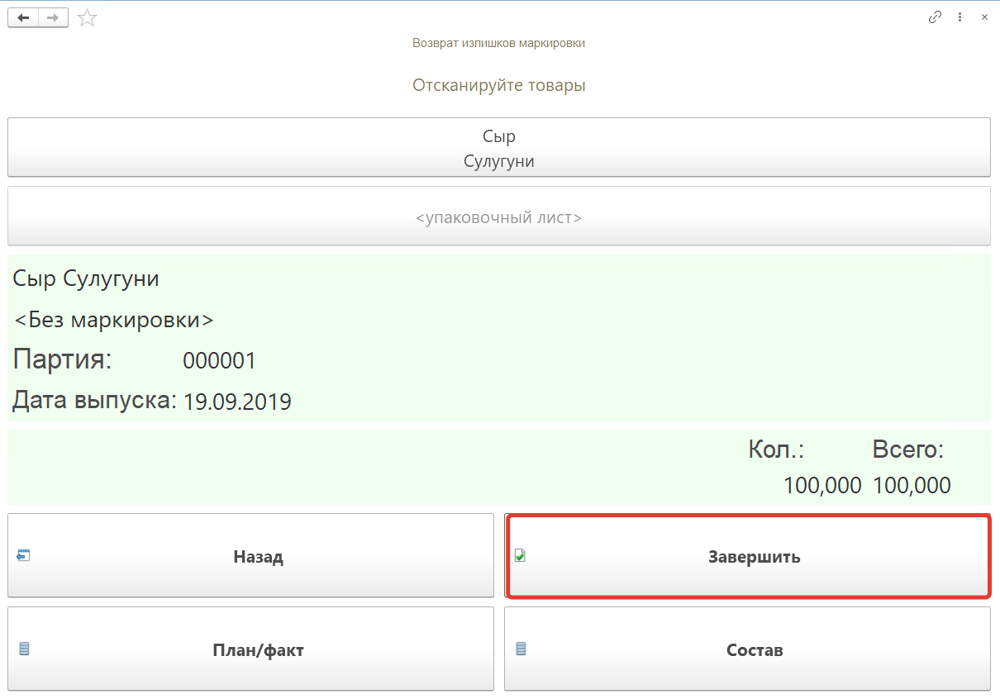

# Возврат излишков маркировки на ТСД

Кнопка **"Возврат излишков маркировка"** используется для возврата излишков сырья.

После открытия формы обработки **"Меню учетных точек"** заполняем поля:

- Дата;
- Смена;
- Учетная точка.

На форме обработки появятся кнопки выбранной учетной точки, выбираем кнопку **"Возврат излишков маркировка"**.

На открывшейся форме появятся строки номенклатуры из **"Производственного задания"** для рабочего центра кнопки. Для каждой строки  будет отражен **план** и **факт** выпуска, а так же **доступное сырье**. В списке при помощи кнопок **"Вверх"** и **"Вниз"** переходим к строке, нажимаем на кнопку **"Выбрать"**.

Далее сканируем штрихкод короба возвращаемого сырья (немаркированной продукции), номенклатура появится на форме.

Посмотреть состав отсканированной номенклатуры можно по кнопке **"Состав"**. На форме появится список номенклатуры, можно удалить строку с помощью кнопки **"Удалить строку"**.

Для завершения работы по возврату излишек сырья нажимаем кнопку **"Завершить"**.

В результате будет сформирован документ **"Распределение материалов"**.

Если в системе ведется [Детальный учет по упаковочным листам](../../Warehouse/LocationOfContainers/LocationPackageLists.md), дополнительных документов сформировано не будет, излишки вернутся остатком на склад, но не на упаковочный лист. Для возврата излишков на упаковочный лист следует выполнить операцию [паллетирования](../../Warehouse/LocationOfContainers/NewPalletMaking.md).
