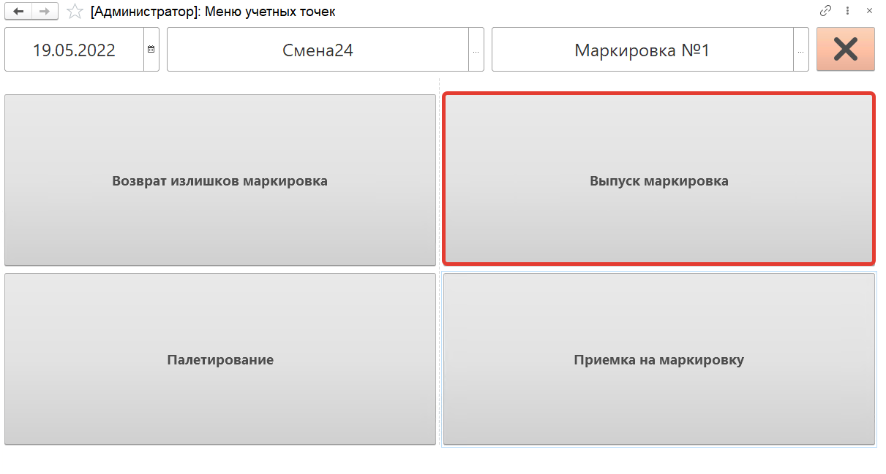
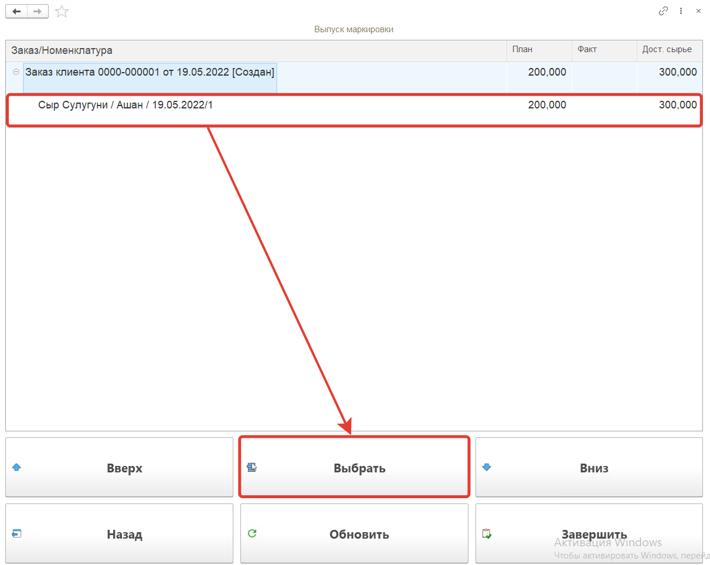
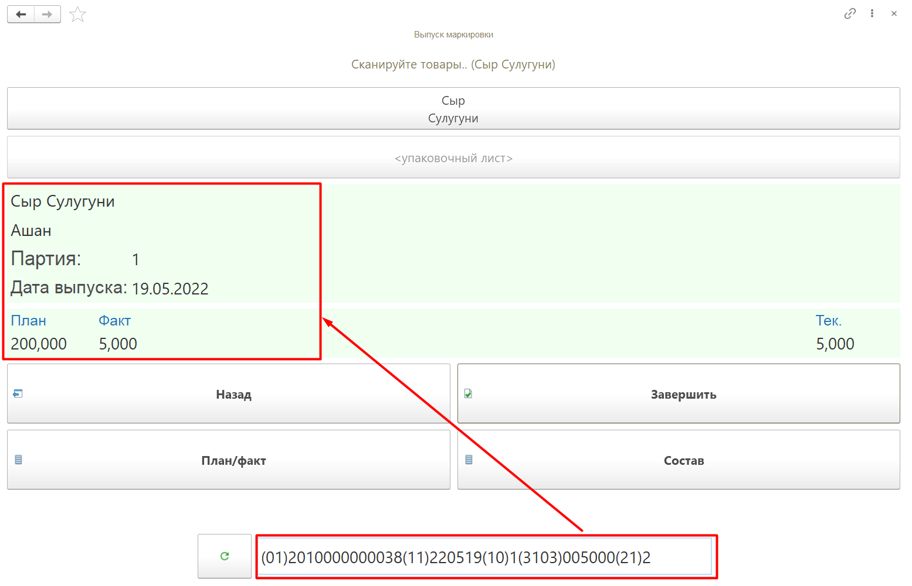
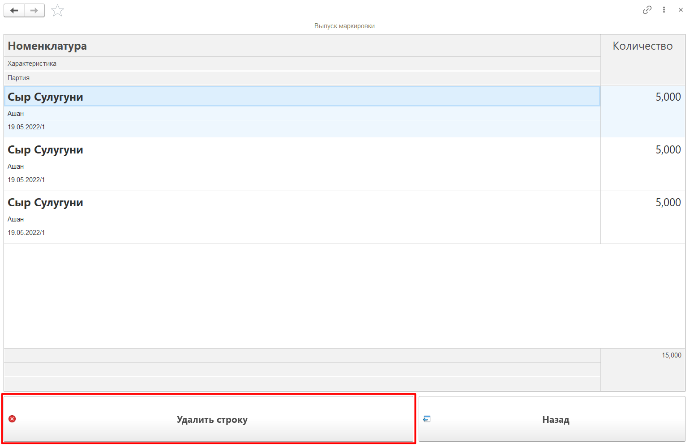
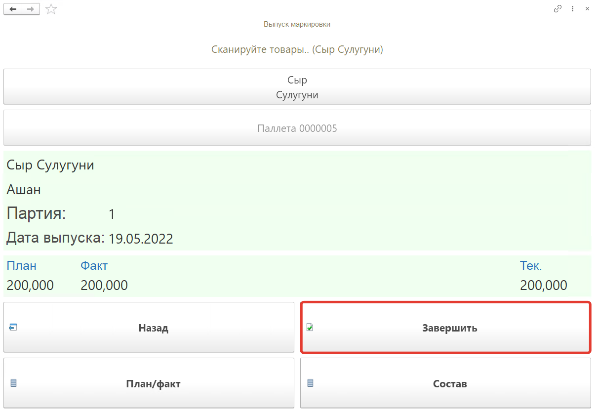

# Выпуск маркировки на ТСД
 
Кнопка **"Выпуск маркировка"** используется для выпуска маркированной продукции.
 
После открытия формы обработки **"Меню учетных точек"** заполняем поля:

- Дата
- Смена
- Учетная точка

На форме обработки появятся кнопки выбранной учетной точки, выбираем кнопку **"Выпуск маркировка"**.
 

 
На открывшейся форме появятся строки номеклатуры из **"Производственного задания"** для рабочего центра кнопки. Длё каждой строки  будет отражен **план** и **факт** выпуска, а так же **доступное сырье**. В списке при помощи кнопок **"Вверх"** и **"Вниз"** переходим к строке, нажимаем на кнопку **"Выбрать"**.
 

 
Далее сканируем штрихкод короба выпускаемой продукции, номенклатура появится на форме.
 

 
Посмотреть состав отсканированной номенклатуры можно по кнопке **"Состав"**. На форме появится список номенклатуры, можно удалить строку с помощью кнопки **"Удалить строку"**.
 

 
Для завершения работы по выпуску маркированной продукции нажимаем кнопку **"Завершить"**.
 

В результате будет сформирован документ **"Переработка"** .

После возврата излишков сырья необходимо вернуться в **"Выпуск маркировки"** и завершить выполненное задание.

Предварительно необходимо сформировать "Упаковочный лист" и в табличной части "Товары" указать:

- Номенклатура "Сыр Сулугуни"
- Характеристика "Ашан"
- Количество "200,000"