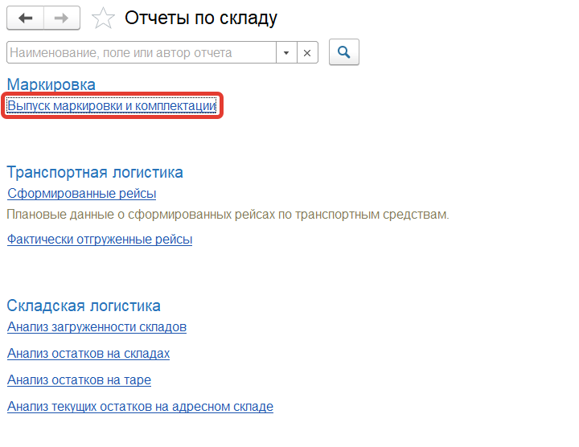
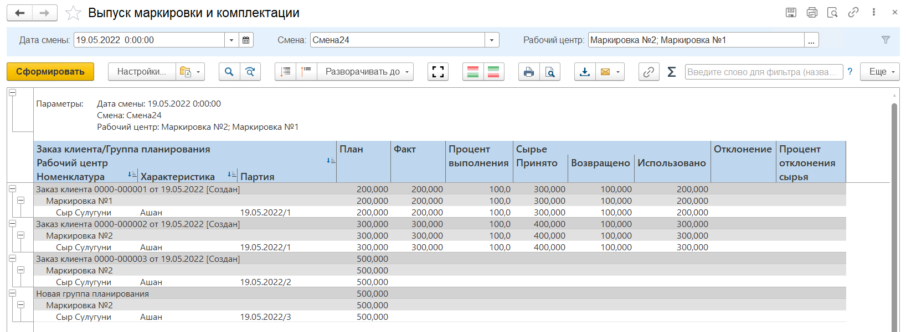

# Отчет "Выпуск маркировки"

Отчет **"Выпуск маркировки"** используется для соотнесения маркированной продукции с рабочими центрами и заказами клиентов. Отчет расположен в разделе **"Склад и доставка"** в подсистеме **"Аналитика"** - **"Отчеты"**.

При открытии отчета  **"Выпуск маркировки"** нужно заполнить поля:

- Дата смены
- Смена

После нажатия на кнопку **"Сформировать"** будет сформирован отчет, строки таблицы отчета будут заполнены в иерархическом порядке информацией по:

- Заказам клиента
- Рабочим центрам
- Номенклатуре, характеристикам, сериям

Столбцы отчета содержат информацию для каждой номенклатуры, рабочего центра и заказа клиента:

- План - количество маркированной продукции по плану
- Факт - количество маркированной продукции по факту
- Процент выполнения
- Сырье

    - Принято
    - Возвращено
    - Использовано
- Отклонение
- Процент отклонения сырья

