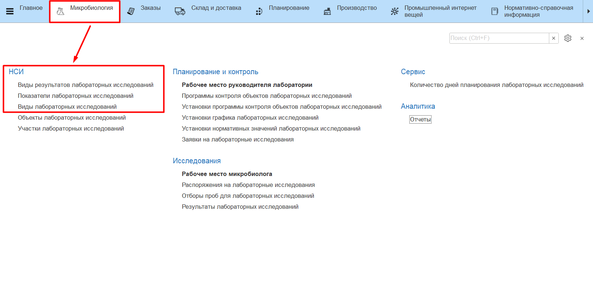
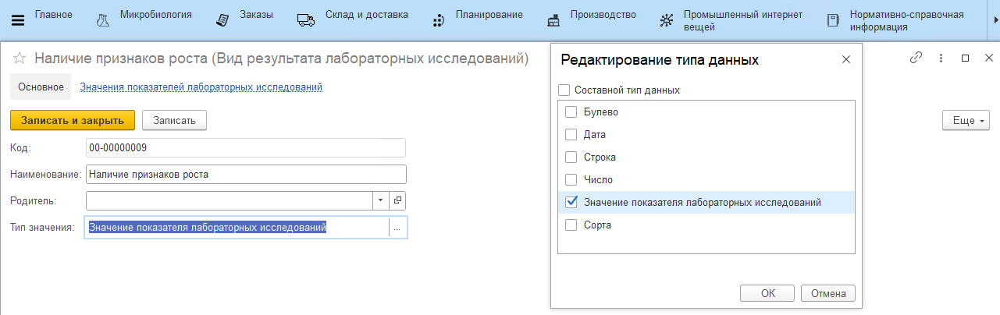
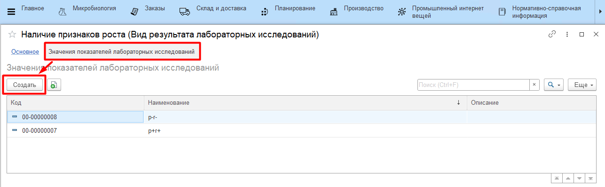
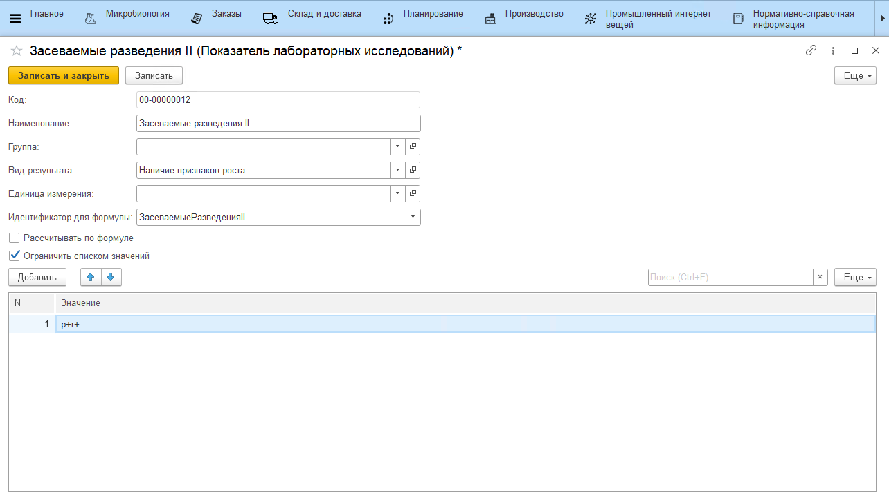
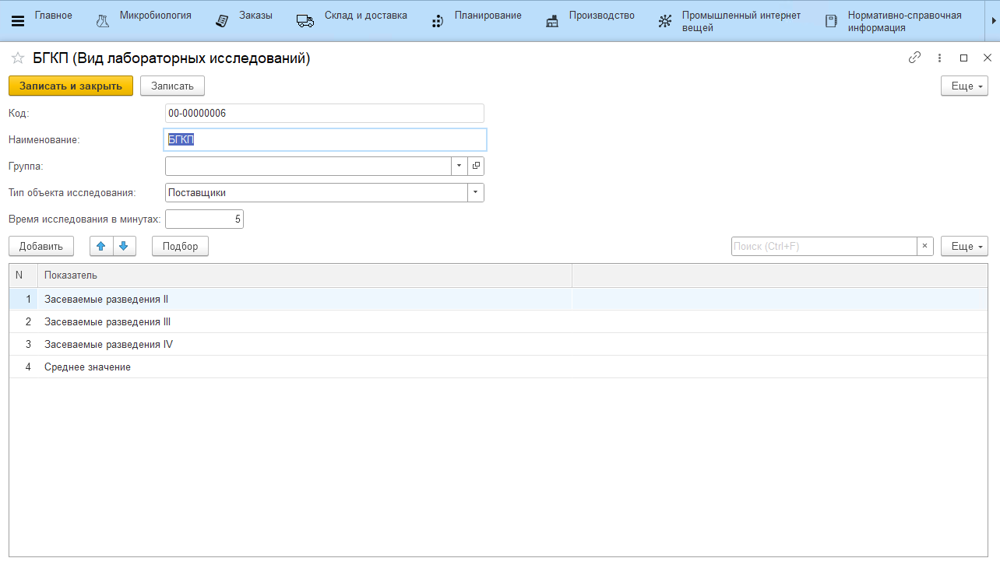

# Виды лаборатных исследований, показатели анализов

В системе MES микробиологический анализ, который проводится над объектом (например, БГКП), является элементом справочника **"Виды лабораторных исследований"**. В такой терминологии **"Показатель лабораторных исследований"** - это какая-либо из метрик анализа. 

## Виды результатов лабораторных исследований

Перед заведением списка анализов необходимо создать перечень значений, которые могут принимать результаты исследования. За это отвечает справочник **"Виды результатов лабораторных исследований"**.

1. открыть справочник **"Виды результатов лабораторных исследований"**;
2. перейти к созданию нового элемента;
3. указать наименование;
4. выбрать тип значения:
    - число;
    - строка;
    - дата;
    - булево;
    - сорта;
    - значение лабораторных исследований - пользовательский список значений, которые могут принимать результаты исследований (задаются в регистре *"Значения показателей лабораторных исследований"*, см. ниже);
    - опция *"Составной тип данных"* позволит показателю иметь результаты разных видов (например, показатель, который имеет значения либо "0" (число), либо "меньше 10" (строка)).

## Показатели лабораторных исследований

Далее необходимо перейти в справочник **"Показатели лабораторных исследований"**. При создании нового показателя заполняются:

- наименование;
- вид результата;
- единица измерения (при необходимости);
- идентификатор для формулы - заполняется автоматически;
- опция *"Рассчитывать по формуле"* - включается, если показатель рассчетный;
- опция *"Ограничить список значений"* - включается, если показатель может принимать только конкретный значения из перечня значений, обозначенных для вида результа.

## Виды лабораторных исследований

Далее заполняются элементы справочника **"Виды лабораторных исследований"**. При создании нового показателя заполняются:

- наименование;
- тип объекта исследования;
- время исследования в минутах - через сколько минут от взятия пробы должен быть готов результат анализа;
- список показателей, которые измеряются в рамках вида - например, для БГКП по сырью поставщиков необходимо измерить количество колоний на чашках засеваемых разведений II, III и IV, а также получившееся среднее значение.

