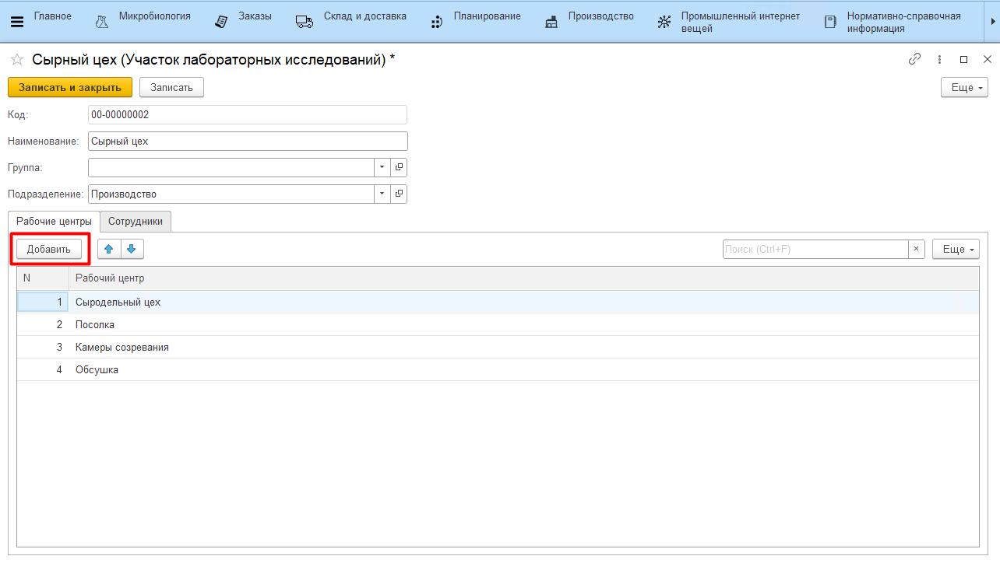
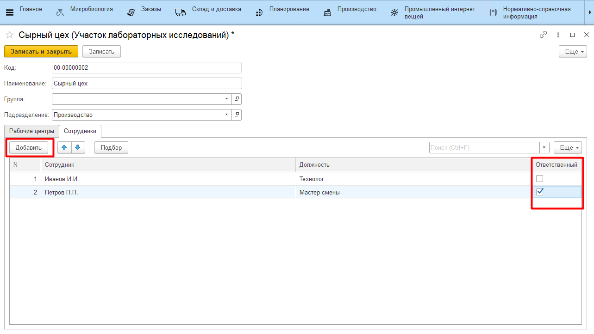

# Участки микробиологического контроля

Справочник **"Участки микробиологического контроля"** содержит информацию об участках, на которых проводятся лабораторные исследования. Как правило, участки мельче по структуре, чем подразделения организации, но крупнее, чем рабочие центры.

Для заведения нового элемента необходимо указать:

- наименование;
- подразделение, к которому относится участок;
- список рабочих центров (могут принадлежать к разным видам РЦ), которые относятся к участку;
- список сотрудников, которые закреплены за участком:
    - должность сотрудника;
    - является ли сотрудник ответственным за участок;

Нажать **"Записать и закрыть"**.

